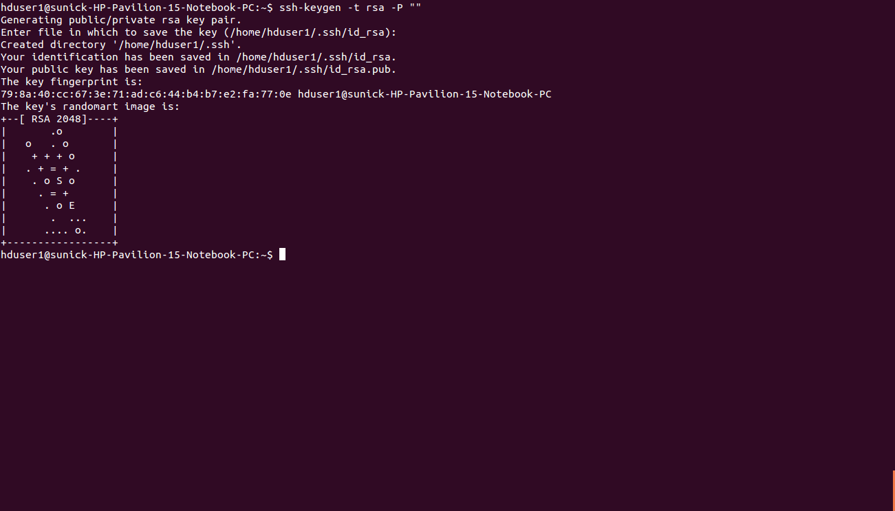
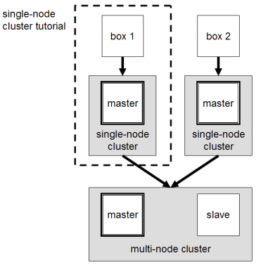
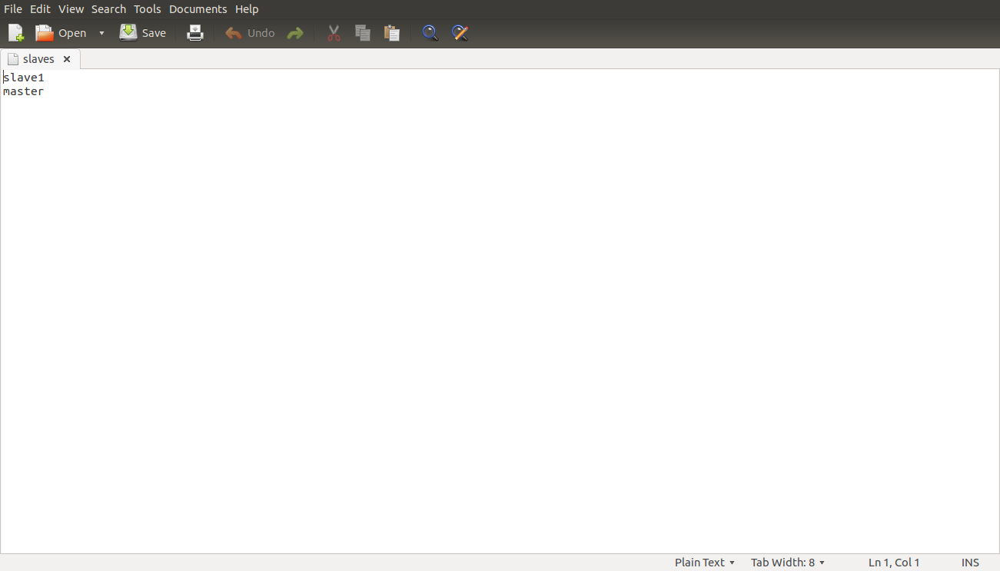
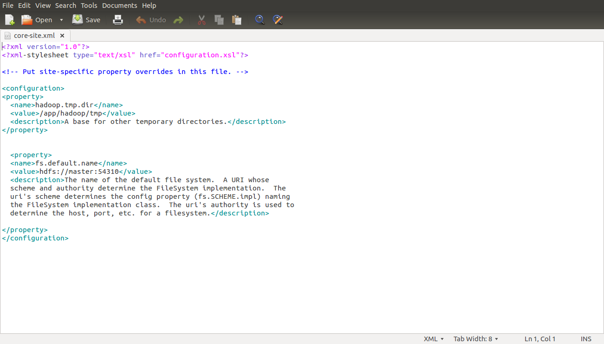
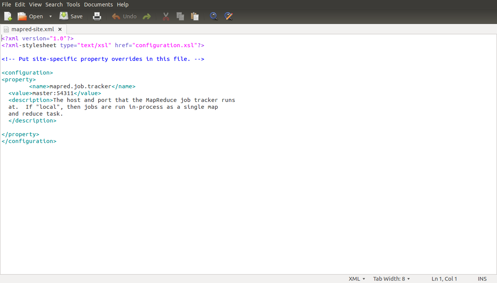
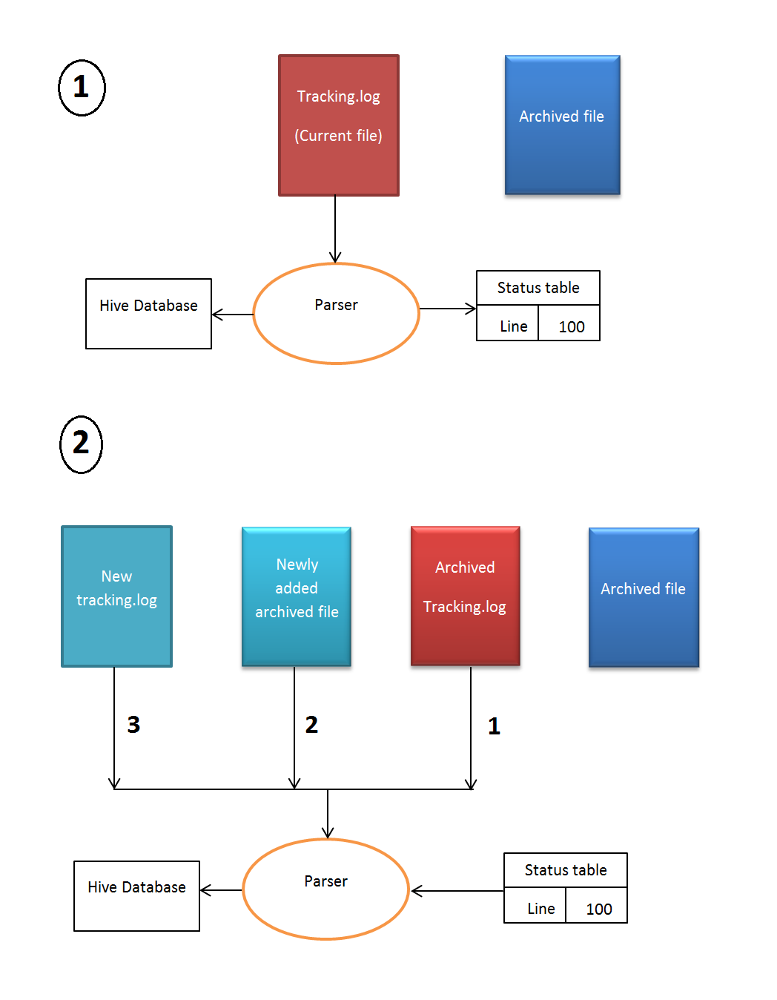

=============
**Abstract**
=============

IIT Bombay now has its contributions(in the form of two courses) to the prestigious edX platform. EdX is a massive open online course (MOOC) destination site and online learning platform that is open sourced, founded by the Massachusetts Institute of Technology and Harvard University. Though it is an ITS(Intelligent Tutoring System), students find out some or the other way to play around with the features of the system through which they reach the final(correct) answer without even thinking deeply about the question asked. So to avoid such instances, we need to determine those students who are gaming the system(behavior aimed at obtaining correct answers and advancing within the tutoring curriculum by systematically taking advantage of regularities in the software’s feedback and help). For this, we analyzed the log files generated by the student activities in the ITS (Intelligent tutoring system) i.e, the edX course site and extracted some features relevant to finding out the students who are gaming the system. Determination of such students will help us in the future to intervene the learning process, so as to prevent such students from  gaming and help them in learning the course.

We have also written queries to extract information which will be useful for data analytics. Using this data, the ITS designer and the course instructors can get useful information as to how well the students are giving positive response to the system and how popular and effecive their courses are. To aid them, a visualized interface has been designed so that it becomes easier and graphically legible to infer such aspects of a student's interest. 

=================
**INTRODUCTION**
=================

What is data analytics and its importance?
==========================================

Data analyticis is a practice in which raw data is ordered and organized so that useful information can be extracted from it. The process of organizing and thinking about data is key to understanding what the data does and does not contain. There are a variety of ways in which people can approach data analysis, and it is notoriously easy to manipulate data during the analysis phase to push certain conclusions or agendas. For this reason, it is important to pay attention when data analysis is presented, and to think critically about the data and the conclusions which were drawn.
Here we are going to analyse the log data which are generated when a student takes any course on edx . Analysing this data , we are going to reach to the conclusion whether a student is gaming the system , while taking the course.If we are successful in determing , which students are gaming , we can apply proper interventions against them.This project can be of great use to ITS in implemetning trustworthy courses , so that the certificates re assigned to only deserving students who have done their course seriously and honestly.We are first going to analyse these data and then apply machine learning in these in order to determine properly which students have been gaming the system.

Why data analysis in educational data?
======================================

In education, the use of data and analytics to improve learning is referred to as learning analytics. Analytics have not yet made the impact on education that they have made in other fields. That’s starting to change. Software companies, researchers, educators, and university leaders recognize the value of data in improving not only teaching and learning, but the entire education sector. In particular, learning analytics enables universities, schools, and corporate training departments to improve the quality of learning and overall competitiveness.

The log files have entries for every activity ever made by a student on the edX platform. Each and every click on tabs or question attempted or a video being played, all the entries are created in the log file. From this log file, we parse out the relevant information and find out patterns to detect that a student is showing any actions involving gaming the system. Gaming, as described above, is any behaviour aimed at obtaining correct answers and advancing within the tutoring curriculum by systematically taking advantage of regularities in the software’s feedback and help. Thus, classifying the gaming students is our priority. This involves careful feature extraction, data analytics and machine learning on the features for classification.
Feedback to the ITS designer and course tutor is equally important. It is essential to know whether the system is doing a good work or not. This involves calculating a student's response based on various categories. A visualized form of such information is useful to them for deciding what reformations they need to apply, so as to make the course even more compelling and interesting to the students.

**PURPOSE**
===========

The main purpose of our project is to determine which student is gaming the system so that we can apply interventions in their tutor system. For example if a question has some hint options, then a student can repeatedly use that hint option to reach to the correct answer. But, this kind of behaviour tampers the process of learning of the student. So, our main aim is to filter out such students who get involved in off-task behaviours and implement interventions only on those students' tutor system, which would passify their gaming process and indirectly motivate them to learn and attempt the quizes whole-heartedly. To implement such a system, relevant feature extraction from the log files is a necessity. Then comes the use of machine learning to classify a student as gaming or not gaming based on the features extracted.

Secondly, data analytics also involves a thorough study of the database containing all the demographic and activity information of a user. From this data, one can infer as to which category of students are mostly interested in learning the course. This requires queries to be written on that data from which we can extract relevant information. A visualized form of such information needs to be created as a feedback to the course designers. Looking at this, they can decide what reformations they need to apply, so as to make the course seem even more compelling and interesting to the students.

**SCOPE**
=========

Implementing the ideas described above will make the tutoring system very efficient while grading a student. Any normal ITS, without any provisions for detection of a student who is gaming and implementing interventions in their system, will award a certificate to any student who has completed the course. But this would make a system very incompetent in correctly grading an undeserving student. Thus our idealogies would aid the ITS in fairly classifying the students into gaming and not gaming and accrordingly award the certificates to the deserving students. In addition, the tutoring system will be able to pick out the 'gaming' students and interevene their learning process so that their learning skills also match the regular students' learning, thereby widening the scope of the efficiency of the edX course site.

=======================
**Overall description**
=======================

EdX-data analyzer uses data genreated by edX  in the form of log entries and the database it creates. Data containing information related to the students is stored in the database 'edxapp'. Data from  edxapp is used for analysis purposes like number of dropouts according to education level, location, gender, number of students according to their eduation level enrolled in a particular course.
Log entries genrated by the server will help us to find if the student is gaming the system or not. EdX-data analyzer will constantly look for the new entries  in the log files and parse, process  them to find wheather students are gaming or not. EdX-data analyzer parses the log file entries and stores them using hive on hadoop distributed file system. 

**Product Functions**
=====================

EdX-data analyzer serves main purpose of determining wheather the student is gaming the system or not. It can be used to interrupt the student who are tring to game the system and adjust the tutor system such that it will be difficult for the student to game the system.

**Constraints**
===============

Analysing the log data to find whether the student is gaming the system or not involves many constriants like diffculties in predicting the state of mind of person by just looking at it's interaction with the system. It is not possible to determine if a student is sleeping while watching the video or whether a student is paying proper attention. Along with difficulties in predicting the state of mind of the student, it is also not possible to note down each and every action or interaction of the user with his/her system due to privacy policies. Instance of this diffcutly can be a situation for example, a student who pauses the video might be pausing the video and indulging in the other off task behavior or a student might be getting confused while watching the video and now try to understand the concept over the internet. As seen in the example, it is difficult to predict the extact state mind of the student. To determine whether the student is gaming or not, detailed analysis is required. Even if we are able to determine whether the student is gaming or not,  we need to take some action to prevent the student from the gaming. But, question is how to determine which steps should be taken to stop the student from gaming as it will depend on the reason behind the gaming which is a furture part of analysis not covered here.

**Assumptions and Dependancies**
================================

EdX-data analyzer assumes that log entries genrated by the EdX ITS server are error free. As only source of input to EdX-data analyzer is data provided by EdX ITS server. EdX-data analyzer totally depends on the EdX ITS for the data.

======================
**Technologies used:**
======================

Hadoop:
-------

Apache Hadoop is an open source software project that enables the distributed processing of large data sets across clusters of commodity servers. It is designed to scale up from a single server to thousands of machines, with a very high degree of fault tolerance. Rather than relying on high-end hardware, the resiliency of these clusters comes from the software’s ability to detect and handle failures at the application layer.

Apache Hadoop has two main subprojects:

MapReduce - The framework that understands and assigns work to the nodes in a cluster.
HDFS - A file system that spans all the nodes in a Hadoop cluster for data storage. It links together the file systems on many local nodes to make them into one big file system. HDFS assumes nodes will fail, so it achieves reliability by replicating data across multiple nodes

Hive:
-----

Hive is a runtime Hadoop support structure that allows anyone who is already fluent with SQL (which is commonplace for relational data-base developers) to leverage the Hadoop platform right out of the gate.
Hive allows SQL developers to write Hive Query Language (HQL) statements that are similar to standard SQL statements. HQL is limited in the commands it understands, but it is still useful. HQL statements are broken down by the Hive service into MapReduce jobs and executed across a Hadoop cluster.

Sqoop:
------

Sqoop is a command-line interface application for transferring data between relational databases and Hadoop. It supports incremental loads of a single table or a free form SQL query as well as saved jobs which can be run multiple times to import updates made to a database since the last import. Imports can also be used to populate tables in Hive or HBase. Exports can be used to put data from Hadoop into a relational database.

============
REQUIREMENTS
============

**Functional Requirements**
===========================

1. The system shall analyse the data based on various parameters of the student such as location,age group,gender etc.
2. The instructor shall be able to choose the comparison parameters and input valid entries to be queried. The instructor shall be able to input the subject for the data to be queried.
3. The data shall be represented in visual format to be understood by the instructor. The visuals formats may include pie-charts,bar charts, line charts etc.
4. The system shall parse the log data and store the parsed data into relevant event related tables.
5. The system shall extract the relevant and useful data from the parsed data.
6. The system shall tell whether a student is gaming a system or not. The system shall do this after analysing the various actions performed by the student while giving the test.

**Performance Requirements**
============================

1. The edx analytics shall support in courses having large number of students (in thousands). There shall be minimal delay in retrieving the data.
2. The analysis shall be done on the data which has not been processed,i.e,only new data shall be considered for analysis. This would avoid the reading of unneccesary data again and again. This would be called as incremental implementation of queries.

**Non Functional Requirments**
==============================

1. The visual diagrams displaying the analysis with various parameters of the student shall be in a easy form so as to be understood by each and every instructor including those belonging to non-mathematical back-ground.

======
HADOOP
======

This section refers to the installation settings of Hadoop on a standalone system
as well as on a system existing as a node in a cluster.

SINGLE-NODE INSTALLATION
************************

Running Hadoop on Ubuntu (Single node cluster setup)
====================================================

The report here will describe the required steps for setting up a single-node Hadoop cluster backed by the Hadoop Distributed File System, running on Ubuntu Linux.
Hadoop is a framework written in Java for running applications on large clusters of commodity hardware and incorporates features similar to those of the Google File System (GFS) and of the MapReduce computing paradigm. Hadoop’s HDFS is a highly fault-tolerant distributed file system and, like Hadoop in general, designed to be deployed on low-cost hardware. It provides high throughput access to application data and is suitable for applications that have large data sets.

Before we start, we will understand the meaning of the following:

DataNode:
---------
A DataNode stores data in the Hadoop File System. A functional file system has more than one DataNode, with the data replicated across them.

NameNode:
---------
The NameNode is the centrepiece of an HDFS file system. It keeps the directory of all files in the file system, and tracks where across the cluster the file data is kept. It does not store the data of these file itself.

Jobtracker:
-----------
The Jobtracker is the service within hadoop that farms out MapReduce to specific nodes in the cluster, ideally the nodes that have the data, or atleast are in the same rack.

TaskTracker:
------------
A TaskTracker is a node in the cluster that accepts tasks- Map, Reduce and Shuffle operatons – from a Job Tracker.

Secondary Namenode:
-------------------
Secondary Namenode whole purpose is to have a checkpoint in HDFS. It is just a helper node for namenode.

PREREQUISITES
=============

Java 6 JDK
----------
Hadoop requires a working Java 1.5+ (aka Java 5) installation.

Update the source list ::

    user@ubuntu:~$  sudo apt-get update

.. figure:: _static/images/1.png
   :height: 700 px
   :width: 1000 px
   :scale: 50 %
   :alt: Use case diagram of the Ticketing System
   :align: center

or

Install Sun Java 6 JDK

Note:
+++++
If you already have Java JDK installed on your system, then you need not run the above command.

To install it ::

    user@ubuntu:~$ sudo apt-get install sun-java6-jdk

The full JDK which will be placed in /usr/lib/jvm/java-6-openjdk-amd64
After installation, check whether java JDK is correctly installed or not, with the following command ::

    user@ubuntu:~$ java -version

Adding a dedicated Hadoop system user
-------------------------------------

We will use a dedicated Hadoop user account for running Hadoop. ::

    user@ubuntu:~$ sudo addgroup hadoop_group

.. figure:: _static/images/3.png
   :height: 700 px
   :width: 1000 px
   :scale: 50 %
   :alt: Use case diagram of the Ticketing System
   :align: center

Command ::

    user@ubuntu:~$ sudo addgroup hadoop_group

This will add the user hduser1 and the group hadoop_group to the local machine.
Add hduser1 to the sudo group ::

    user@ubuntu:~$ sudo adduser hduser1 sudo

Configuring SSH
---------------

The hadoop control scripts rely on SSH to peform cluster-wide operations. For example, there is a script for stopping and starting all the daemons in the clusters. To work seamlessly, SSh needs to be etup to allow password-less login for the hadoop user from machines in the cluster. The simplest ay to achive this is to generate a public/private key pair, and it will be shared across the cluster.

Hadoop requires SSH access to manage its nodes, i.e. remote machines plus your local machine. For our single-node setup of Hadoop, we therefore need to configure SSH access to localhost for the hduser user we created in the earlier.

We have to generate an SSH key for the hduser1 user. ::

    user@ubuntu:~$ su – hduser1
    hduser1@ubuntu:~$ ssh-keygen -t rsa -P ""

The second line will create an RSA key pair with an empty password.

Note:
+++++
P “”, here indicates an empty password

You have to enable SSH access to your local machine with this newly created key which is done by the following command. ::

    hduser1@ubuntu:~$ 	cat $HOME/.ssh/id_rsa.pub >> $HOME/.ssh/authorized_keys

The final step is to test the SSH setup by connecting to the local machine with the hduser1 user.
The step is also needed to save your local machine’s host key fingerprint to the hduser1 user’s known hosts file. ::

    hduser1@ubuntu:~$ ssh localhost

If the SSH connection fails, we can try the following (optional):

- Enable debugging with ssh -vvv localhost and investigate the error in detail.
- Check the SSH server configuration in /etc/ssh/sshd_config.  If you made any changes to the SSH server configuration file, you can force a configuration reload with sudo /etc/init.d/ssh reload.

INSTALLATION
============

Main Installation
-----------------

- Now, I will start by switching to hduser1 ::

    hduser1@ubuntu:~$ su - hduser1

- Now, download and extract Hadoop 1.2.0
We now have to move the extracted folder to the directory /usr/local
The command to be used::

	hduser1@ubuntu:~$ sudo mv /home/a_user/Downloads/hadoop /usr/local

Note: a_user is a user registered to ubuntu.

- Setup Environment Variables for Hadoop

Add the following entries to .bashrc file, here we use the nano editor ::

 	hduser1@ubuntu:~$  sudo nano ~/.bashrc

Add the following entries to .bashrc file ::

    # Set Hadoop-related environment variables
    export HADOOP_HOME=/usr/local/hadoop
    # Add Hadoop bin/ directory to PATH
    export PATH= $PATH:$HADOOP_HOME/bin

Configuration
-------------

hadoop-env.sh
+++++++++++++

Replace current JAVA_HOME value in
/usr/local/hadoop/etc/hadoop/hadoop-env.sh with /usr/lib/jvm/jdk/

Steps:

1. Command ::

        hduser1@ubuntu:~$ sudo nano /usr/local/hadoop/conf/hadoop-env.sh

2.  Edit the value of JAVA_HOME with /usr/lib/jvm/jdk(version you have installed)
3.	The jdk above refers to the java JDK you hav installed.

OR (depending on the version of Hadoop you download)

Change the file:
conf/hadoop-env.sh ::

    #export JAVA_HOME=/usr/lib/j2sdk1.5-sun

to
in the same file ::

    # export JAVA_HOME=/usr/lib/jvm/java-6-openjdk-amd64  (for 64 bit)
    # export JAVA_HOME=/usr/lib/jvm/java-6-openjdk-amd64  (for 32 bit)

conf/*-site.xml
+++++++++++++++

Now we create the directory and set the required ownerships and permissions ::

    hduser1@ubuntu:~$ sudo mkdir -p /app/hadoop/tmp
    hduser1@ubuntu:~$ sudo chown hduser:hadoop /app/hadoop/tmp
    hduser1@ubuntu:~$ sudo chmod 750 /app/hadoop/tmp

The last line gives reading and writing permissions to the /app/hadoop/tmp directory

- **Error**: If you forget to set the required ownerships and permissions, you will see a java.io.IO Exception when you try to format the name node.

Open the fllowing file using ::

	hduser1@ubuntu:~$ sudo nano *-site.xml

Paste the following between <configuration>

- **In file conf/core-site.xml** ::

    <property>
        <name>hadoop.tmp.dir</name>
        <value>/app/hadoop/tmp</value>
        <description>A base for other temporary directories.</description>
    </property>

    <property>
        <name>fs.default.name</name>
        <value>hdfs://localhost:54310</value>
        <description>The name of the default file system.  A URI whose
        scheme and authority determine the FileSystem implementation.  The
        uri's scheme determines the config property (fs.SCHEME.impl) naming
        the FileSystem implementation class.  The uri's authority is used to
        determine the host, port, etc. for a filesystem.</description>
    </property>

- **In file conf/mapred-site.xml** ::

    <property>
    <name>mapred.job.tracker</name>
        <value>localhost:54311</value>
        <description>The host and port that the MapReduce job tracker runs
        at.  If "local", then jobs are run in-process as a single map
        and reduce task.
        </description>
    </property>

- **In file conf/hdfs-site.xml** ::

    <property>
        <name>dfs.replication</name>
        <value>1</value>
        <description>Default block replication.
        The actual number of replications can be specified when the file is created.
        The default is used if replication is not specified in create time.
        </description>
    </property>

Formatting the HDFS filesystem via the NameNode
-----------------------------------------------

To format the filesystem (which simply initializes the directory specified by the dfs.name.dir variable).
Run the command ::

    hduser1@ubuntu:~$ /usr/local/hadoop/bin/hadoop namenode –format

Starting your single-node cluster
---------------------------------

Before starting the cluster, we need to give the required permissions to the directory with the following command ::

    hduser1@ubuntu:~$ sudo chmod -R 777 /usr/local/hadoop

Run the command ::

    hduser1@ubuntu:~$ /usr/local/hadoop/bin/start-all.sh

This will startup a Namenode, Datanode, Jobtracker and a Tasktracker on the machine. ::

    hduser1@ubuntu:/usr/local/hadoop$ jps

.. figure:: _static/images/8.png
   :height: 700 px
   :width: 1000 px
   :scale: 50 %
   :alt: Use case diagram of the Ticketing System
   :align: center

Errors:
+++++++

1. If by chance your datanode is not starting, then you have to erase the contents of the folder /app/hadoop/tmp
    The command that can be used ::

        hduser1@ubuntu:~:$ sudo rm –Rf /app/hadoop/tmp/*

2. You can also check with netstat if Hadoop is listening on the configured ports.
    The command that can be used ::

        hduser1@ubuntu:~$ sudo netstat -plten | grep java

3. Errors if any, examine the log files in the /logs/ directory.

Stopping your single-node cluster
---------------------------------

Run the command to stop all the daemons running on your machine. ::

    hduser1@ubuntu:~$ /usr/local/hadoop/bin/stop-all.sh

ERROR POINTS:
+++++++++++++

If datanode is not starting, then clear the tmp folder before formatting the namenode using the following command ::

    hduser1@ubuntu:~$ rm -Rf /app/hadoop/tmp/*

Note:
+++++
- The masters and slaves file should contain localhost.
- In /etc/hosts, the ip of the system should be given with the alias as localhost.
- Set the java home path in hadoop-env.sh as well bashrc.

MULTI-NODE INSTALLATION
***********************

Running Hadoop on Ubuntu Linux (Multi-Node Cluster)
===================================================

From single-node clusters to a multi-node cluster
-------------------------------------------------

We will build a multi-node cluster merge two or more single-node clusters into one multi-node cluster in which one Ubuntu box will become the designated master but also act as a slave , and the other box will become only a slave.

Prerequisites
=============

Configuring single-node clusters first, here we have used two single node clusters.
Shutdown each single-node cluster with the following command ::

    user@ubuntu:~$  bin/stop-all.sh

Networking
==========

- The easiest is to put both machines in the same network with regard to hardware and   software configuration.

- Update /etc/hosts on both machines .Put the alias to the ip addresses of all the machines. Here we are creating a cluster of 2 machines , one is master and other is slave 1 ::

    hduser@master:$  cd /etc/hosts

- Add the following lines for two node cluster ::

     10.105.15.78    master  (IP address of the master node)
     10.105.15.43    slave1   (IP address of the slave node)

SSH access
==========
The hduser user on the master (aka hduser@master) must be able to connect:

1. to its own user account on the master - i.e. ssh master in this context.
2. to the hduser user account on the slave (i.e. hduser@slave1) via a password-less SSH login.

- Add the hduser@master public SSH key using the following command ::

    hduser@master:~$  ssh-copy-id -i $HOME/.ssh/id_rsa.pub hduser@slave1

.. figure:: _static/images/11.png
   :height: 700 px
   :width: 1000 px
   :scale: 50 %
   :alt: Use case diagram of the Ticketing System
   :align: center

- Connect with user hduser from the master to the user account hduser on the slave.

1. From master to master ::

    hduser@master:~$  ssh master

.. figure:: _static/images/12.png
   :height: 700 px
   :width: 1000 px
   :scale: 50 %
   :alt: Use case diagram of the Ticketing System
   :align: center

2. From master to slave ::

    hduser@master:~$  ssh slave1

.. figure:: _static/images/13.png
   :height: 700 px
   :width: 1000 px
   :scale: 50 %
   :alt: Use case diagram of the Ticketing System
   :align: center

Hadoop
======

Cluster Overview
----------------
This will describe how to configure one Ubuntu box as a master node and the other Ubuntu box as a slave node.

Configuration
-------------

conf/masters
++++++++++++
The machine on which bin/start-dfs.sh is running will become the primary NameNode.
This file should be updated on all the nodes. Open the masters file in the conf directory ::

    hduser@master/slave :~$ /usr/local/hadoop/conf
    hduser@master/slave :~$ sudo gedit masters

Add the following line ::

    Master

conf/slaves
+++++++++++
This file should be updated on all the nodes as master is also a slave.
Open the slaves file in the conf directory ::

    hduser@master/slave:~/usr/local/hadoop/conf$ sudo gedit slaves

Add the following lines ::

    Master
    Slave1

conf/*-site.xml (all machines)
++++++++++++++++++++++++++++++

conf/core-site.xml
++++++++++++++++++

Open this file in the conf directory ::

    hduser@master:~/usr/local/hadoop/conf$ sudo gedit core-site.xml

Change the fs.default.name parameter (in conf/core-site.xml), which specifies the NameNode (the HDFS master) host and port.

conf/core-site.xml (ALL machines .ie. Master as well as slave) ::

    <property>
        <name>fs.default.name</name>
        <value>hdfs://master:54310</value>
        <description>The name of the default file system.  A URI whose
        scheme and authority determine the FileSystem implementation.  The
        uri's scheme determines the config property (fs.SCHEME.impl) naming
        the FileSystem implementation class.  The uri's authority is used to
        determine the host, port, etc. for a filesystem.</description>
    </property>

conf/mapred-site.xml
++++++++++++++++++++

Open this file in the conf directory ::

    hduser@master:~$  /usr/local/hadoop/conf
    hduser@master:~$  sudo gedit mapred-site.xml

Change the mapred.job.tracker parameter (in conf/mapred-site.xml), which specifies the JobTracker (MapReduce master) host and port.

conf/mapred-site.xml (ALL machines) ::

    <property>
        <name>mapred.job.tracker</name>
        <value>master:54311</value>
        <description>The host and port that the MapReduce job tracker runs
        at.  If "local", then jobs are run in-process as a single map
        and reduce task.
        </description>
    </property>

conf/hdfs-site.xml
++++++++++++++++++

Open this file in the conf directory ::

    hduser@master:~$  /usr/local/hadoop/conf
    hduser@master:~$  sudo gedit hdfs-site.xml

Change the dfs.replication parameter (in conf/hdfs-site.xml) which specifies the default block replication.
We have two nodes available, so we set dfs.replication to 2.

conf/hdfs-site.xml (ALL machines)
+++++++++++++++++++++++++++++++++

Changes to be made ::

    <property>
    <name>dfs.replication</name>
    <value>2</value>
    <description>Default block replication.
        The actual number of replications can be specified when the file is created.
        The default is used if replication is not specified in create time.
        </description>
    </property>

.. figure:: _static/images/18.png
   :height: 700 px
   :width: 1000 px
   :scale: 50 %
   :alt: Use case diagram of the Ticketing System
   :align: center

Formatting the HDFS filesystem via the NameNode
-----------------------------------------------

Format the cluster’s HDFS file system ::

    hduser@master:~/usr/local/hadoop$ bin/hadoop namenode -format

.. figure:: _static/images/19.png
   :height: 700 px
   :width: 1000 px
   :scale: 50 %
   :alt: Use case diagram of the Ticketing System
   :align: center

Starting the multi-node cluster
-------------------------------

Starting the cluster is performed in two steps.

1. We begin with starting the HDFS daemons: the NameNode daemon is started on master, and DataNode daemons are started on all slaves (here: master and slave).

2. Then we start the MapReduce daemons: the JobTracker is started on master, and TaskTracker daemons are started on all slaves (here: master and slave).

Cluster is started by running the commnd on master ::

    hduser@master:~$   /usr/local/hadoop
    hduser@master:~$   bin/start-all.sh

.. figure:: _static/images/20.png
   :height: 700 px
   :width: 1000 px
   :scale: 50 %
   :alt: Use case diagram of the Ticketing System
   :align: center

By this command:

- The NameNode daemon is started on master, and DataNode daemons are started on all slaves (here: master and slave).
- The JobTracker is started on master, and TaskTracker daemons are started on all slaves (here: master and slave)

To check the daemons running , run the following commands ::

    hduser@master:~$  jps

On slave, datanode and jobtracker should run. ::

    hduser@slave:~/usr/local/hadoop$ jps

Stopping the multi-node cluster
-------------------------------

To stop the multinode cluster , run the following command on master pc ::

    hduser@master:~$ cd /usr/local/hadoop
    hduser@master:~/usr/local/hadoop$ bin/stop-all.sh

.. figure:: _static/images/23.png
   :height: 700 px
   :width: 1000 px
   :scale: 50 %
   :alt: Use case diagram of the Ticketing System
   :align: center

ERROR POINTS:
+++++++++++++

1. Number of slaves = Number of replications in hdfs-site.xml
    also number of slaves = all slaves + master(if master is also considered to be a slave)

2. When you start the cluster, clear the tmp directory on all the nodes (master+slaves) using the following command ::

    hduser@master:~$   rm -Rf /app/hadoop/tmp/*

3. Configuration of /etc/hosts , masters  and slaves files on both the masters and the slaves nodes should be the same.

4. If namenode is not getting started run the following commands:

    - To give all permissions  of hadoop folder to hduser ::

        hduser@master:~$  sudo chmod -R 777 /app/hadoop

    - This command deletes the junk files which gets stored in tmp folder of hadoop ::

        hduser@master:~$  sudo rm -Rf /app/hadoop/tmp/*

====
HIVE
====

This section refers to the installation settings of Hive on a standalone system
as well as on a system existing as a node in a cluster.

INTRODUCTION
************

    Apache Hive is a data warehouse infrastructure built on top of Hadoop for providing data summarization, query, and analysis. Apache Hive supports analysis of large datasets stored in Hadoop's HDFS and compatible file systems such as Amazon S3 filesystem. It provides an SQL-like language called HiveQL(Hive Query Language) while maintaining full support for map/reduce.

Hive Installation
*****************

Installing HIVE:
================

- Browse to the link: http://apache.claz.org/hive/stable/

- Click the apache-hive-0.13.0-bin.tar.gz

- Save and Extract it

    Commands ::

        user@ubuntu:~$  cd  /usr/lib/
        user@ubuntu:~$  sudo mkdir hive
        user@ubuntu:~$  cd Downloads
        user@ubuntu:~$  sudo mv apache-hive-0.13.0-bin /usr/lib/hive

Setting Hive environment variable:
==================================

Commands ::

    user@ubuntu:~$  cd
    user@ubuntu:~$  sudo gedit  ~/.bashrc

Copy and paste the following lines at end of the file ::

    # Set HIVE_HOME
    export HIVE_HOME="/usr/lib/hive/apache-hive-0.13.0-bin"
    PATH=$PATH:$HIVE_HOME/bin
    export PATH

Setting HADOOP_PATH in HIVE config.sh
=====================================

Commands ::

    user@ubuntu:~$ cd  /usr/lib/hive/apache-hive-0.13.0-bin/bin
    user@ubuntu:~$ sudo gedit hive-config.sh

Go to the line where the following statements are written ::

    # Allow alternate conf dir location.
    HIVE_CONF_DIR="${HIVE_CONF_DIR:-$HIVE_HOME/conf"
    export HIVE_CONF_DIR=$HIVE_CONF_DIR
    export HIVE_AUX_JARS_PATH=$HIVE_AUX_JARS_PATH

Below this write the following ::

    export HADOOP_HOME=/usr/local/hadoop
    (write the path where hadoop file is there)

Create Hive directories within HDFS
===================================

Command ::

    user@ubuntu:~$   hadoop fs -mkdir /usr/hive/warehouse

Setting READ/WRITE permission for table
========================================

Command ::

    user@ubuntu:~$  hadoop fs -chmod g+w /usr/hive/warehouse

HIVE launch
============

Command ::

    user@ubuntu:~$  hive

Hive shell will prompt:

OUTPUT
------

Shell will look like ::

    Logging initialized using configuration in
    jar:file:/usr/lib/hive/apache-hive-0.13.0-bin
    /lib/hive- common-0.13.0.jar!/hive-log4j.properties
    hive>

Creating a database
===================

Command ::

    hive> create database mydb;

OUTPUT ::

    OK
    Time taken: 0.369 seconds
    hive>

Configuring hive-site.xml:
==========================

Open with text-editor and change the following property ::

    <property>
        <name>hive.metastore.local</name>
        <value>TRUE</value>
        <description>controls whether to connect to remove metastore server
        or open a new metastore server in Hive Client JVM</description>
    </property>

    <property>
        <name>javax.jdo.option.ConnectionURL</name>
        <value>jdbc:mysql://usr/lib/hive/apache-hive-0.13.0-bin/metastore_db?
        createDatabaseIfNotExist=true</value>
        <description>JDBC connect string for a JDBC metastore</description>
    </property>

    <property>
        <name>javax.jdo.option.ConnectionDriverName</name>
        <value>com.mysql.jdbc.Driver</value>
        <description>Driver class name for a JDBC metastore</description>
    </property>

    <property>
        <name>hive.metastore.warehouse.dir</name>
        <value>/usr/hive/warehouse</value>
        <description>location of default database for the warehouse</description>
     </property>

Writing a Script
================

Open a new terminal (CTRL+ALT+T) ::

    user@ubuntu:~$ 	sudo gedit sample.sql

    create database sample;
    use sample;
    create table product(product int, productname string, price float)
    [row format delimited fields terminated by ',';]
    describe product;

load data local inpath '/home/hduser/input_to_product.txt' into table product ::

    select * from product;

SAVE and CLOSE ::

    user@ubuntu:~$ sudo gedit input_to_product.txt
    user@ubuntu:~$ cd /usr/lib/hive/apache-hive-0.13.0-bin/ $ bin/hive -f
    /home/hduser/sample.sql

=====
SQOOP
=====

This section refers to the installation settings of Sqoop.

INTRODUCTION
============

- Sqoop is a tool designed to transfer data between Hadoop and relational databases.
- You can use Sqoop to import data from a relational database management system(RDBMS) such as MySQL or Oracle into the Hadoop Distributed File System (HDFS), transform the data in Hadoop MapReduce, and then export the data back into an RDBMS. Sqoop automates most of this process, relying on the database to describe the schema for the data to be imported. Sqoop uses MapReduce to import and export the data, which provides parallel operation as well as fault tolerance. This document describes how to get started using Sqoop to move data between databases and Hadoop and provides reference information for the operation of the Sqoop command-line tool suite.

.. figure:: _static/images/25.png
   :height: 700 px
   :width: 1000 px
   :scale: 50 %
   :alt: Use case diagram of the Ticketing System
   :align: center

Stable release and Download
===========================

Sqoop is an open source software product of the Apache Software Foundation.
Sqoop source code is held in the Apache Git repository.

Prerequisites
=============

Before we can use Sqoop, a release of Hadoop must be installed and configured. Sqoop is currently supporting four major Hadoop releases - 0.20, 0.23, 1.0 and 2.0. We have installed Hadoop 2.2.0 and it is compatible with sqoop 1.4.4.We are using a Linux environment Ubuntu 12.04 to install and run sqoop. The basic familiarity with the purpose and operation of Hadoop is required to use this product.

Installation
============

To install the sqoop 1.4.4 we followed the given sequence of steps :

1.  Download the sqoop-1.4.4.bin_hadoop-1.0.0.tar.gz  file from the link

    http://www.apache.org/dyn/closer.cgi/sqoop/1.4.4

    then click on this link:
    http://mirror.sdunix.com/apache/sqoop/1.4.4

    and download this zip:

    *sqoop-1.4.4.bin__hadoop-1.0.0.tar.gz*

2. Change the directory to downloads using this command ::

	user@ubuntu:~$  cd Downloads

3. Unzip the tar ::

    user@ubuntu:~$ sudo tar -zxvf sqoop-1.4.4.bin__hadoop-1.0.0.tar.gz

4. Move sqoop-1.4.4.bin hadoop1.0.0 to sqoop using command ::

    user@ubuntu:~$  sudo mv sqoop 1.4.4.bin__hadoop-1.0.0 /usr/local/sqoop

5. Create a directory sqoop in usr/lib using command ::

    user@ubuntu:~$ sudo mkdir /usr/lib/sqoop

6. Go to the zipped folder sqoop-1.4.4.bin_hadoop-1.0.0 and run the command ::

    user@ubuntu:~sudo mv ./* /usr/lib/sqoop

7.  Go to root directory using cd command ::

    user@ubuntu:~$  cd

8.  Open bashrc file using ::

    user@ubuntu:~$  sudo gedit ~/.bashrc

9. Add the following lines ::

    export SQOOP_HOME=/usr/lib/sqoop
    export PATH=$PATH:$SQOOP_HOME/bin

10. To check if the sqoop has been installed  successfully type the command ::

    user@ubuntu:~$ sqoop version

IMPORTING DATA FROM HADOOP TO MYSQL
===================================

Steps to install mysql
**********************

Run the command ::

    sudo apt-get install mysql-server

and give appropriate username and password.

Using sqoop to perform import to hadoop from sql
************************************************

1. Download mysql-connector-java-5.1.28-bin.jar and move to /usr/lib/sqoop/lib using command ::

    user@ubuntu:~$ sudo cp mysql-connnectpr-java-5.1.28-bin.jar
    /usr/lib/sqoop/lib/

2. Login to mysql using command ::

    user@ubuntu:~$   mysql -u root -p

3. Login to secure shell using command ::

    user@ubuntu:~$  ssh localhost

4. Start hadoop using the command ::

    user@ubuntu:~$  bin/hadoop start-all.sh

5. Run the command ::

    user@ubuntu:~$ sqoop import -connect
    jdbc:mysql://localhost:3306/sqoop -username root
    -pasword abc -table employees -m

This command imports the employees table from the sqoop directory of myql to hdfs.

Error points
************

1. Do check if the hadoop is in safe mode using command ::

    user@ubuntu:~$hadoop dfsadmin -safemode get

If you are getting safemode is on, run the command ::

    user@ubuntu:~$hadoop dfsadmin -safemode leave

and again run the command ::

    user@ubuntu:~$hadoop dfsadmin -safemode get

and confirm that you are getting safemode is off.

2. Do make sure that haoop is running before performing the import action.

===============
EdX Description
===============

EdX is a massive open online course (MOOC) destination site and online learning platform that is open sourced, founded by the Massachusetts Institute of Technology and Harvard University.

What we have done is analyze the log files generated by the student activities in the ITS (Intelligent tutoring system) i.e, the edX course site. The ultimate goal of our project is to determine that how many students enrolled in a course are actually interested in learning the course. If there are such students who are not interested in actually learning the course, then what are the activities they divulge into as an alternative in order to attain the course certificate. Such off-task behaviours have been termed as students 'gaming' the system. Determination of such students will help us in the future to intervene the learning process, so as to prevent such students from gaming and help them in learning the course.

For this purpose, we are provided with the edX database which has the following tables (database 'edxapp') :

* assessment_assessment
* assessment_assessmentfeedback
* assessment_assessmentfeedback_assessments
* assessment_assessmentfeedback_options
* assessment_assessmentfeedbackoption
* assessment_assessmentpart
* assessment_criterion
* assessment_criterionoption
* assessment_peerworkflow
* assessment_peerworkflowitem
* assessment_rubric
* auth_group
* auth_group_permissions
* auth_permission
* auth_registration
* auth_user
* auth_user_groups
* auth_user_user_permissions
* auth_userprofile
* bulk_email_courseauthorization
* bulk_email_courseemail
* bulk_email_courseemailtemplate
* bulk_email_optout
* celery_taskmeta
* celery_tasksetmeta
* certificates_certificatewhitelist
* certificates_generatedcertificate
* circuit_servercircuit
* course_creators_coursecreator
* course_groups_courseusergroup
* course_groups_courseusergroup_users
* course_modes_coursemode
* courseware_offlinecomputedgrade
* courseware_offlinecomputedgradelog
* courseware_studentmodule
Out of these tables, the tables we used for analysis were auth_user, auth_userprofile and courseware_studentmodule. The rest tables being empty, we could not process much information from them.

auth_user
=========

This table contains the following information of every user who has registered in the edx database :

* id
* username
* first_name
* last_name
* email
* password
* is_staff
* is_active
* is_superuser
* last_login
* last_joined

The columns is_staff, is_active and is_superuser are all binary valued and meanings can be easily predicted from ther names. The 'is_active' column holds the value '1' for those users who have confirmed their registration by clicking on the activation link sent to them on their mail.

auth_userprofile
================

This table holds the demographic data collected from a student during the registration process and contains the following columns :

* id
* user_id
* name
* language
* location
* meta
* courseware
* gender
* mailing_address
* year_of_birth
* level_of_education
* goals
* allow_certificate
* country
* city

courseware_studentmodule
========================

This table holds the courseware state of every student and has the following columns:

* id
* module_type
* module_id
* student_id
* state
* grade
* created
* modified
* max_grade
* done
* course_id

Using these tables we have come up with some hive queries(described in the following section) for the analytics part.

Research paper study
====================

After all the installation procedures, we studied the research paper, “Detecting Student Misuse of Intelligent Tutoring Systems” authored by Ryan Shaun Baker, Albert T. Corbett, Kenneth R. Koedinger and gave a presentation on it. Their study says that students who are averted to such ‘gaming the system behaviour’ (behavior aimed at obtaining correct answers and advancing within the tutoring curriculum by systematically taking advantage of regularities in the software’s feedback and help) learn 2/3rds as much as similar students who do not engage in such behaviors. They came up with a machine-learned latent response model that can identify whether a student is gaming the system or not. Based on these predictions, the tutor can be re-designed for such students and make their learning process effective.

Baker and his colleagues found that a student’s frequency of gaming was strongly negatively correlated with learning. According to them, understanding why students game the system will be essential in deciding how the system should respond. Ultimately, though, whatever remediation approach is chosen, it is likely to have costs as well as benefits. For instance, preventive approaches, such as changing interface widgets to make them more difficult to game or delaying successive levels of help to prevent rapid-fire usage, may reduce gaming, but at the cost of making the tutor more frustrating and less time-efficient for other students. Since many students use help effectively and seldom or never game the system, the costs of using such an approach indiscriminately may be higher than the rewards. Whichever approach we take to remediating gaming the system, the success of that approach is likely to depend on accurately and automatically detecting which students are gaming the system and which are not.

The LRM they suggested, takes 24 features as input or data source and also the predetermined value of the student ‘gaming or not’ of a training set of 70 students. Then it uses forward selection for model selection and then finally implements iterative gradient descent to find the best model parameters. The best-fitting model had 4 parameters, and no model considered had more than 6 parameters. They also used a cross-validation techninque, LOOCV (Leave One Out Cross Validation). Finally with the ROC (Receiver Operating Characteristic) curve, they classified the student as gaming or not gaming. On this result, they applied the interventions in the ITS.

===============
**Log Parsing**
===============

Log files provides information about the event data that is delivered in data packages. Events are emitted by the server or the browser to capture information about interactions with the courseware and the Instructor Dashboard in the LMS, and are stored in JSON documents. In the data package, event data is delivered in a log file.The JSON documents that include event data are delivered in a machine-readable format that is difficult to read . A sample is the following :- ::

   {"agent": "Mozilla/5.0 (X11; Linux x86_64) AppleWebKit/537.36
   (KHTML, like Gecko)Chrome/30.0.1599.101 Safari/537.36", "context":
   {"course_id": "edx/AN101/2014_T1","module": {"display_name":
   "Multiple Choice Questions"}, "org_id":"edx", "user_id":
   9999999}, "event": {"answers": {"i4x-edx-AN101-problem-a0effb954
   cca4759994f1ac9e9434bf4_2_1":"yellow", "i4x-edx-AN101-problem-a0
   effb954cca4759994f1ac9e9434bf4_4_1": ["choice_0", "choice_2"]},
   "attempts": 1, "correct_map": {"i4x-edx-AN101-problem-a0effb954c
   ca4759994f1ac9e9434bf4_2_1":{"correctness": "incorrect", "hint":
   "", "hintmode": null, "msg": "", "npoints": null,"queuestate": null}
   , "i4x-edx-AN101-problem-a0effb954cca4759994f1ac9e9434bf4_4_1":
   {"correctness": "correct", "hint": "", "hintmode": null, "msg": "",
   "npoints": null,"queuestate": null}}, "grade": 2, "max_grade": 3,
   "problem_id": "i4x://edx/AN101/problem/a0effb954cca4759994f1ac9e94
   34bf4", "state": {"correct_map": {}, "done": null, "input_state":
   {"i4x-edx-AN101-problem-a0effb954cca4759994f1ac9e9434bf4_2_1": {},
   "i4x-edx-AN101-problem-a0effb954cca4759994f1ac9e9434bf4_4_1": {}},
   "seed": 1, "student_answers": {}}, "submission":{"i4x-edx-AN101-
   problem-a0effb954cca4759994f1ac9e9434bf4_2_1": {"answer": "yellow",
   "correct":false, "input_type": "optioninput", "question": "What color
   is the open ocean on a sunny day?","response_type": "optionresponse",
   "variant": ""}, "i4x-edx-AN101-problem-a0effb954cca4759994f1ac9e943
   4bf4_4_1": {"answer": ["a piano", "a guitar"], "correct": true,
   "input_type": "checkboxgroup", "question": "Which of the following
   are musical instruments?","response_type": "choiceresponse", "variant":
   ""}}, "success": "incorrect"}, "event_source":"server", "event_type":
   "problem_check", "host": "precise64", "ip": "NN.N.N.N", "page": "x_module",
   "time": 2014-03-03T16:19:05.584523+00:00", "username": "AAAAAAAAAA"}

We can use pretty print( by jq '.' command) to see this information in a readable format which is shown as below :- ::

   {
      "agent": "Mozilla/5.0 (X11; Linux x86_64) AppleWebKit/537.36
      (KHTML, like Gecko)
      Chrome/30.0.1599.101 Safari/537.36",
      "context": {
          "course_id": "edx/AN101/2014_T1",
          "module": {
              "display_name": "Multiple Choice Questions"
          },
          "org_id": "edx",
          "user_id": 9999999
      },
      "event": {
          "answers": {
              "i4x-edx-AN101-problem-a0effb954cca4759994f1ac9e9434bf4_2_1":"yellow",
              "i4x-edx-AN101-problem-a0effb954cca4759994f1ac9e9434bf4_4_1": [
                  "choice_0",
                  "choice_2"
              ]
          },
          "attempts": 1,
          "correct_map": {
              "i4x-edx-AN101-problem-a0effb954cca4759994f1ac9e9434bf4_2_1":{
                  "correctness": "incorrect",
                  "hint": "",
                  "hintmode": null,
                  "msg": "",
                  "npoints": null,
                  "queuestate": null
              },
              "i4x-edx-AN101-problem-a0effb954cca4759994f1ac9e9434bf4_4_1":{
                  "correctness": "correct",
                  "hint": "",
                  "hintmode": null,
                  "msg": "",
                  "npoints": null,
                  "queuestate": null
              }
          },
          "grade": 2,
          "max_grade": 3,
          "problem_id": "i4x://edx/AN101/problem/a0effb954cca4759994f1ac9e9434bf4",
          "state": {
              "correct_map": {},
              "done": null,
              "input_state": {
                  "i4x-edx-AN101-problem-a0effb954cca4759994f1ac9e9434bf4_2_1":{},
                  "i4x-edx-AN101-problem-a0effb954cca4759994f1ac9e9434bf4_4_1":{}
              },
              "seed": 1,
              "student_answers": {}
          },
          "submission": {
              "i4x-edx-AN101-problem-a0effb954cca4759994f1ac9e9434bf4_2_1": {
                  "answer": "yellow",
                  "correct": false,
                  "input_type": "optioninput",
                  "question": "What color is the open ocean on a sunny day?",
                  "response_type": "optionresponse",
                  "variant": ""
              },
              "i4x-edx-AN101-problem-a0effb954cca4759994f1ac9e9434bf4_4_1": {
                  "answer": [
                      "a piano",
                      "a guitar"
                  ],
                  "correct": true,
                  "input_type": "checkboxgroup",
                  "question": "Which of the following are musical instruments?",
                  "response_type": "choiceresponse",
                  "variant": ""
              }
          },
          "success": "incorrect"
      },
      "event_source": "server",
      "event_type": "problem_check",
      "host": "precise64",
      "ip": "NN.N.N.N",
      "page": "x_module",
      "time": "2014-03-03T16:19:05.584523+00:00",
      "username": "AAAAAAAAAA"
   }
   

The JSON object 'event_source' is the most important feture we are dealing with. All the entries in the tracking.log file get parsed into the log table of our database. There is an entry corresponding to every event generated in the log files. Different types of events are generated. Common fields of those events are as follows:-
 
:Agent:
| Browser agent string of the user who triggered the event
:Context:
| For all events, this field includes member fields that identify:
   * The course_id of the course that generated the event. 
   * The org_id of the organization that lists the course. 
   * The user_id of the individual who is performing the action. 
:Event:
| This field includes member fields that identify specifics of each triggered event.
:event_source:
| Specifies whether the triggered event originated in the browser or on the server.
:event_type:
| The type of event triggered.
:Host:
| The site visited by the user, for example, courses.edx.org.
:ip:
| IP address of the user who triggered the event.
:page:
| The '$URL' of the page the user was visiting when the event was emitted.
:session:
| This 32-character value is a key that identifies the user's session.
:time:
| Gives the UTC time at which the event was emitted in 'YYYY-MM- DDThh:mm:ss.xxxxxx' format.
:username:
| The username of the user who caused the event to be emitted. This string is empty for anonymous events, such as when the user is not logged in.

| Each and every event has its own attributes. Various types of events generated which we have used are as follows:-

* Problem_check generated at two sources , browser and server.
* Problem_show
* load_video
* play_video
* speed_change_video
* seek_video
* pause_video  

Procedure
=========

| Entries of log files are parsed and then stored in database.
| For each log entry genral data like ip address, event_type, event_source is stored in table log.
| Data related to specific event_type is stored in corresponding tables like play_video, puase_video.

The entries of log files are parsed and then stored in database which has the following tables.

:Log:
| This table stores the common log entries of all types of events and has the  folllowing fields:-

* id
* course_id
* org_id
* user_id
* event_type
* event_type
* event_source
* host
* ip
* page
* time
* username

:load_video:
| This table stores details of log entries whose event_type is load_video.Here the log_id corresponds to the id of log table.This table has   the following columns:-
* log_id
* code

:pause_video:
| This table stores details of log entries whose event_type is pause_video.  Here the log_id                 corresponds  to the id of log table.This table has the following columns:-

* log_id
* code
* current_time

:play_video:
| This table stores details of log entries whose event_type is play_video.  Here the log_id                 corresponds  to the id of log table.This table has the following columns:-
* log_id
* code
* current_time

:problem_check_browser:
| This table stores details of log entries whose event_type is problem_check and event source is browser.  Here the log_id    corresponds  to the id of log table.This table has the following columns:-
* log_id

:problem_check_server:
| This table stores details of log entries whose event_type is problem_check and event source is server.  Here the log_id    corresponds  to the id of log table.This table has the following columns:-
* problem_id
* log_id
* problem_id
* hint
* hintmode
* correctness
* response_type
* input_type

:problem_show:
| This table stores details of log entries whose event_type is problem_show.  Here the log_id                 corresponds  to the id of log table.This table has the following columns:-
* log_id
* problem_id

:seek_video:
| This table stores details of log entries whose event_type is seek_video.  Here the log_id                 corresponds  to the id of log table.This table has the following columns:-
* log_id
* code
* old_time
* new_time

:speed_change_video:
| This table stores details of log entries whose event_type is speed_change_video.  Here the log_id   corresponds  to the id of log table.This table has the following columns:-
* log_id
* code
* current_time
* old_speed
* new_speed

:load_video:
| This table stores details of log entries whose event_type is load_video.  Here the log_id corresponds  to the id of log table.This table has the following columns:-
* log_id
* code

:status:
| This table stores the attributes related to the log files and the files which have been archived.Some examples are size,line read , date modified.
* name
* int

*Database Schema*

Following jar files are used in the the java program to parse the log files:-

* java-json.jar
* apache-logging-log4j.jar
* commons-httpclient-3.0.1.jar
* commons-logging-1.1.3.jar
* hadoop-core-1.2.0.jar
* hive-cli-0.13.0.jar
* hive-common-0.13.0.jar
* hive-exec-0.13.0.jar
* hive-jdbc-0.13.0.jar
* hive-metastore-0.13.0.jar
* hive-service-0.13.0.jar
* hive.txt
* libfb303-0.9.0.jar
* libthrift-0.9.0.jar
* log4j-1.2.16.jar
* slf4j-api-1.7.7.jar
* slf4j-jdk14-1.7.7.jar

Let the old_size be the size of the file which has been already parsed and whose value has been stored in the status table. Let new_size be the size of the log file at present.
There are three cases for the log files which are as folllows:-

| 1. old_size < new_size

It means that new entries has been added to the log files .
The value of number of lines that have been parsed is stored in status table .That value is retrieved and those many lines skipped.Rest of the lines are parsed.Log entries are in the form of json .Folllowing is a snippet for this case:- ::

    public class LineParser {
    public int parseline(String line)
    {
       int success=0;
       Database db = new Database();
       JSONObject rootObject;
       try {
           //parsing json object in the form of string passed by edxparser
           rootObject = new JSONObject(line);

           //creating object of log class to hold the data parsed
           //from the json objects.
           Log log = new Log();

       //parsing nested object context
	        JSONObject context = rootObject.getJSONObject("context");
	        log.setCourse_id(context.get("course_id").toString();
	        log.setOrg_id(context.get("org_id").toString);
	        try
	        {
	        	log.setUser_id((Integer)context.get("user_id"));
	        }
	        catch(Exception e)
	        {
	        	log.setUser_id(0);
	        }
	        try
	        {
		    //parsing the nested json object module
	            JSONObject module = context.getJSONObject("module");
	            log.setModule(module.get("display_name").toString());
	        }
	        catch (Exception e)
	        {
	        	log.setModule("");
	        }
	        log.setEvent_source(rootObject.get("event_source").toString());
	        log.setEvent_type(rootObject.get("event_type").toString());
	        log.setHost(rootObject.get("host").toString());
	        log.setIp(rootObject.get("ip").toString());
	        log.setPage(rootObject.get("page").toString());

        //converting time into desired format
	        String time = rootObject.get("time").toString();
	        String time2=time.substring(0, 10);
	        time2=time2.concat(" ");
	        time2=time2.concat(time.substring(11,19));
	        log.setTime(time2);
	        log.setUsername(rootObject.get("username").toString());
	        log.setEvent(rootObject.get("event").toString());
	        try
	        {
	        	log.setSession(rootObject.get("session").toString());
	        }
	        catch(Exception e)
	        {
	        	log.setSession("");
	        }

        //passing log object to the function insertlogdate to be inserted
        //into the database.
	    	success = db.insertlogdata(log);
        }
        catch (JSONException e1)
        {
          e1.printStackTrace();
        }
    return success;
    }
    }

| 2. old_size=new_size

| The log file has not changed and no new entries added.

| 3. old_size >new_size

| This means that the log file has been archived.So all those file whose modification time is greater than the time stored in the status table, which is the modification time of the log file just processed, are retrieved and extracted.
| It is possible that the current file which program was parsing is modified i.e., new log entries are added to the file and is now archived. So, we need to find the archived file corresponding to the file which was being parsed and parse and process if any new entries were added to the file.
| The file whose modification date is oldest among those files is the file which was archived while program was parsing it. Those new entries which were added are parsed with the help of values such as linesparsed and size of file stored in the status table.Rest of the files are processed from beginning to the end.

Following is a code snippet of the following case::

    public class  {
   	public void handlefile()
   	{
   		//directory containing log data
   		File mydirectory = new File("/home/sachin/workspace/json
   		/src/json/log");
   		
   		System.out.println(mydirectory.isDirectory());

        //creating the array of files to store list of all files in the
        //log directory.
   		File names[] = mydirectory.listFiles();
   		Database db = new Database();
   		
   		//getting filelastmodified date
   		long lastmdate=db.getfilelastmodified();
   		
   		//creating arraylist to store new tar.gz files
   		ArrayList<File> left = new ArrayList<File>();
   		
   		//adding new files into the arraylist
   		for(int i=0;i<names.length;i++) {
        if(names[i].lastModified()>lastmdate&&names[i].toString().matches(".*gz$"))
        {
            left.add(names[i]);
            System.out.println("got match: "+names[i].lastModified()+" "+names[i]);
        }
   		}
   	
        //creating the table to sort content according to the modification date
   		long table[][] = new long[left.size()][2];
   		
   		//intializing two dimensional array
   		for(int i=0;i<left.size();i++)
   		{
   			table[i][0] = i;
   			table[i][1] = left.get(i).lastModified();
   			System.out.println(table[i][0]+" "+table[i][1]);
   		}
   		
   		//sorting according to the date
   		for (int c = 0; c <  left.size(); c++) 
   		{
   		   for (int d = 0; d < left.size() - c - 1; d++) 
   		   {
   			   if(table[d][1] > table[d+1][1])
   			   {
   				   long swap = table[d][0];
   				   table[d][0]=table[d+1][0];
   				   table[d+1][0]=swap;
   				   swap = table[d][1];
   				   table[d][1]=table[d+1][1];
   				   table[d+1][1]=swap;
   			   }
   		   }
   		}
   		InputStream is=null;
   		boolean first=true;
   		String line;

        //creating object of lineparser to parse the json object from archived
        //files
   		LineParser lp = new LineParser();
   		for(int i=0;i<left.size();i++)
   		{
        try
        {

        //first represents the oldest file in the log folder which is not processed.
        if(first)
        {

            System.out.println("started reading file "+left.get((int)table[i][0]));
            int linenum = db.getlinenum();
            System.out.println("line count in file"+linenum);
            is=new GZIPInputStream(new FileInputStream(left.get((int)table[i][0])));
            BufferedReader buffered = new BufferedReader(new InputStreamReader(is));
            int j=0;
            //skipping already parsed lines
            while(j<linenum)
            {
                if((line=buffered.readLine())!=null)
                {
                    j++;
                    System.out.println("The value of the j is "+j);
                }
            }
            while((line=buffered.readLine())!=null)
            {
                System.out.println(line);
                if(line.startsWith("{"))
                {
                    lp.parseline(line);
                }
            }
            buffered.close();

            //setting value of the first to false to indicate oldest file has been
            //already parsed
            first=false;
            db.setfilelastmodified(left.get((int) table[i][0]).lastModified());
        }
        else
        {

            System.out.println("started reading file "+left.get((int)table[i][0]));
            is=new GZIPInputStream(new FileInputStream(left.get((int)table[i][0])));
            Reader decoder = new InputStreamReader(is, "UTF-8");
            BufferedReader buffered = new BufferedReader(decoder);
            while((line=buffered.readLine())!=null)
            {
                if(line.startsWith("{"))
                {
                    lp.parseline(line);
                }
                System.out.println(line);
            }
            buffered.close();
            db.setfilelastmodified(left.get((int) table[i][0]).lastModified());
        }
        }
        catch(Exception e)
        {
            System.out.println("error while reading tar.gz files"+left.get
            ((int) table[i][0]));
        }
   		}
		
        //resetting the entries in status table to the value zero.
   		db.setsize(0);
   		db.insertlinenum(0);
   	}
    }

And the flowchart for the same is:

| Diagram 1 represent program parsing the tracking.log file and storing the value of number of lines parsed into the table status.
| Diagram 2 represents the state when the file which program was previously parsing is now archived, it is possible that few log entries were added to this file and before the program parse those log entries tracking.log is archived. It may happen that the newly genrated tracking.log file is also archived before the program starts parsing the tracking.log file in this way, log directory will contain the two archived files one which is partially processed and the one which is not at all processed.

  

After the classification has been done, queries were written on the tables to extract the features required for implementing machine learning.

The database schema above defined was first made in mysql. Then it was imported into hive by sqoop. But later on, we came up with a method by which we could directly connect with hive from the java program.

============================
Connection of Hive with Java
============================

| Since we are using JAVA programs for feature extraction on the tables of HIVE , we need to connect to HIVE in JAVA program .We can run Hive queries from a Java Database Connectivity (JDBC)  Connectivity (ODBC) application using  the Hive JDBC  driver. The Hive JDBC driver allows you to access Hive from a Java program  that uses JDBC to communicate with database products. 

| Hive provides a Type 4 (pure Java) JDBC driver, defined in the class an application that can connect to a Hive server using the Hive JDBC driver  org.apache.hadoop.hive.jdbc.HiveDriver. When configured with a JDBC URI of the form jdbc:hive://host:port/dbname, a Java application can connect to a Hive server running at the specifed host and port. The driver makes calls to an interface implemented by the Hive Thrift Client using the Java Thrift bindings. Before connecting to HIVE in a JAVA program , we need to run hiveserver on a particular port.The default port number for hiveserver is 10000.We need to mention this port number in our JAVA program.

The project which is connecting to hive should have the following jar files incuded:

* apache-logging-log4j.jar
* commons-httpclient-3.0.1.jar
* commons-logging-1.1.3.jar
* hadoop-core-1.2.0.jar
* hive-cli-0.13.0.jar
* hive-common-0.13.0.jar
* hive-exec-0.13.0.jar
* hive-jdbc-0.13.0.jar
* hive-metastore-0.13.0.jar
* hive-service-0.13.0.jar
* hive.txt
* libfb303-0.9.0.jar
* libthrift-0.9.0.jar
* log4j-1.2.16.jar
* slf4j-api-1.7.7.jar
* slf4j-jdk14-1.7.7.jar

The Connect class code snippet looks like : ::

    Class.forName("org.apache.hadoop.hive.jdbc.HiveDriver");
    Connection connect = DriverManager.getConnection
    ("jdbc:hive://localhost:10000/exptnew", "", "");
    System.out.println("Connected successfully");
    return(connect);

==================
Feature Extraction
==================

In order to determine if a student is gaming the system or not, we have written some queries on the parsed log data (the database we created for the entries from the log file). The features we came up with are :-

| 1. To calculate the minimum number of attempts a student takes in correctly answering a question
| 2. To calculate the amount of tme a student is seeking a video
| 3. To calculate the difficulty level of each question in every course
| 4. To calculate the activity level of a student per day.

Feature 1
~~~~~~~~~

In order to find the difficulty level of the question, it is required to know in how many minimum number of attempts a student was able to answer the question correctly. Edx allows a user to answer a question any number of times even after the student has already given the correct answer. This is why we need to consider only the first attempt in which the student correctly answered the question. As analyzing the attempts after the user has already correctly answered the question is futile because student already knew the answer and those extra attempts will only mean revision for the student or that the student is just playing around with the system.

The java class written for this purpose is Feature_no_of_attempts. The following snippet fulfills the above described functionality :- ::

   //storing data into temporary table
   //start and end are obtained form status and log table
   //respectively.
   statement.executeQuery("insert overwrite table temp select
   problem_id,username,min(attempts)
   from problem_check_server where log_id>"+start+" and
   log_id<="+end+" and correctness='correct'
   group by problem_id,username");

    System.out.println("first and last "+start+" "+end);
    //inserting dummy entries into the table attempts
    statement.executeQuery("insert into table attempts select
     p.problem_id,p.username,0
    from temp p where not exists(select * from attempts where
    problem_id=p.problem_id and
    username=p.username)");
    resultset=statement.executeQuery("select * from temp");
    while(resultset.next())
    {
        a=resultset.getString(1);
        b=resultset.getString(2);
        c=resultset.getInt(3);
        //modifying the dummy entries with the help of temporary
         //table
        statement.executeQuery("insert overwrite table attempts
        select problem_id,username,
        case when problem_id='"+a+"' and username='"+b+"' then
        "+c+" else attempts end as
        attempts from attempts");
        System.out.println(resultset.getString(1)+resultset.
        getString(2)+resultset
        .getString(3));
    }

Finding the number of minimum attempts per user per question has been done in three steps. This feature has been extracted using incremental approach. First step is to identify the new users from newly generated log entries and store them into temporary table along with the minimum number of attempts per question in the corresponding log entries. Second step is to insert dummy entries into the table attempts for the user not already present in the attempts table. Third step is to insert the values extracted in the temporary table into the attempts table.

*Image for Minimum no. of attemps*

Feature 2
~~~~~~~~~

One of those features is to calculate the amount of time a user seeked a video. For this, the details of a video is also required. As such information wasn't provided, a project named 'Download'(package name 'fetch_video_information') was written to extract the details of a video.

The table created for this purpose was 'video_information'. The steps involved in this program are:

1. Fetch the video code from the log parsed database('load_video' table) in the Database class.
2. Pass this video code into the URL (in the Down class): http://gdata.youtube.com/feeds/api/videos/"+video_code+"?v=2&alt=jsonc Example - http://gdata.youtube.com/feeds/api/videos/dXb3Tx8V4hU?v=2&alt=jsonc opens the following :- ::

    {"apiVersion":"2.1","data":{"id":"dXb3Tx8V4hU","uploaded":"2013-02-23T11:
    16:41.000Z","updated":"2013-02-23T11:16:41.000Z","uploader":"aakashlab",
    "category":"People","title":"Android UI and Layouts part 2","description"
    :"","thumbnail":{"sqDefault":"http://i1.ytimg.com/vi/dXb3Tx8V4hU/default.
    jpg","hqDefault":"http://i1.ytimg.com/vi/dXb3Tx8V4hU/hqdefault.jpg"},
    "player":{"default":"http://www.youtube.com/watch?v=dXb3Tx8V4hU&feature
    =youtube_gdata_player","mobile":"http://m.youtube.com/details?v=dXb3Tx8
    V4hU"},"content":{"5":"http://www.youtube.com/v/dXb3Tx8V4hU?version=3&f
    =videos&app=youtube_gdata","1":"rtsp://r2---sn-a5m7zu7z.c.youtube.com/C
    iILENy73wIaGQkV4hUfT_d2dRMYDSANFEgGUgZ2aWRlb3MM/0/0/0/video.3gp","6":"r
    tsp://r2---sn-a5m7zu7z.c.youtube.com/CiILENy73wIaGQkV4hUfT_d2dRMYESARFE
    gGUgZ2aWRlb3MM/0/0/0/video.3gp"},"duration":308,"viewCount":371,"favori
    teCount":0,"commentCount":0,"accessControl":{"comment":"allowed","comme
    ntVote":"allowed","videoRespond":"moderated","rate":"allowed","embed":"
    allowed","list":"allowed","autoPlay":"allowed","syndicate":"allowed"}}}

3. The above URL opens a page containing the JSON object about that video. So, next we downloaded this piece of information into a file.

The code snippet for the same looks like ::

    URL url = new URL("http://gdata.youtube.com/feeds/api/videos/
    "+video_code+"?v=2&alt=jsonc");

	Snippet ::

        Scanner s = new Scanner(url.openStream());
        String line;
        while(s.hasNext())
        {
        line=s.nextLine();
        File file = new File("/home/dell/workspace/
        Download/src/videoJson.json");

        // if file doesnt exists, then create it
        if (!file.exists())
        {
            file.createNewFile();
        }

        FileWriter fw = new FileWriter(file.getAbsoluteFile());
        BufferedWriter bw = new BufferedWriter(fw);
        bw.write(line);
        bw.close();

        System.out.println(line);

        JsonParser.parseJson(video_code);
        }
4. Then, we parsed out the objects, title and duration from this JSON object (in the JsonParser class).

The code snippet for the same looks like ::

     JSONObject obj = new JSONObject(jsonStr);
     String title = obj.getJSONObject("data").getString("title");
     System.out.println(title);
     JSONObject obj2 = new JSONObject(jsonStr);
     int duration = (int) obj2.getJSONObject("data").get("duration");
     System.out.println(duration);
     Database.putdata(video_code,title,duration);

5. Finally this information was stored back in the table 'video_information' (in the Database class).

This process was repeated for all video codes.(Run the Download only when new entries are required)

Connection with hive was made by using the Connect class.

After the video_information table is ready, the main queries for extraction of seek time can be implemented.

:Extracting the amount of time a student seeked(or skipped) a video: 

This feature is concerned with extracting the amount of time a student has skipped a portion of the video. If a student is seeking a video more than the amount of his/her viewed time, then the student is likely not interested in the course (But it is also possible that a student is skipping one video only beacuse he/she has some knowledge about that topic. This is difficult to track beacuse we cannot estimate a student's knowledge on a specific topic. And it is very rare to find a student who will seek almost all the videos in a given course, provided that he/she already knows about this topic. In that case the student wouldn't have selected the course. As we are keeping track of the seek time of all videos in a course for each student, the case of a student seeking just one or two odd videos beacause he/she had some previous knowledge in it will be handled in the mapping function later described in futher topic).

The  java class written for this purpose is Feature_seek_time. The following snippet fulfills the above described functionality :::

   statement.executeQuery("drop table temp0");
   statement.executeQuery("create table temp0(code string,username
   string,seek int)");
   statement.executeQuery("create table seek_time_total(code string,
   username string,seek int,title
   string,duration int)");
   statement.executeQuery("insert into table temp0 select sv.code,
   sv.username,sum(sv.new_time-sv.old_time)
   from seek_video sv where log_id>="+start+" and log_id<"+end+" and
   not exists(select * from temp0 t2
   where sv.code=t2.code and sv.username=t2.username) group by sv.code,
   sv.username ");
   resultset=statement.executeQuery("select * from temp0");
   statement.executeQuery("insert overwrite table seek_time_total select
   a.code,a.username,a.seek,
   b.title,b.duration from temp0 a join  video_information b on
   a.code=b.code");
   resultset=statement.executeQuery("select * from seek_time_total");
   while(resultset.next())
   {
   System.out.println(resultset.getString(1)+"\t"+resultset.
   getString(2)+"\t"+resultset
   .getString(3)+"\t"+resultset.getString(4)+"\t"+resultset.
   getString(5)+"\t");
   }
   statement.executeQuery("insert overwrite table status select

   name, instring, case when
   name='seek_time_processed' then "+end+" else inint end as
   inint from status");

The sample output space looks like :

  ===========   ======== ====    =============================   ========
  code		username seek    title                           duration
  ===========   ======== ====    =============================   ========
  RU2qJTO0Gms	ak	 764	 IntroductionToAndroidPart1      927	
  RU2qJTO0Gms	sachin   696	 IntroductionToAndroidPart1	 927	
  KdX4DaFRAKU	ak	 440	 Android UI and Layouts part-1	 415	
  KdX4DaFRAKU	oshin	 26	 Android UI and Layouts part-1	 415	
  2E_KTtnbzVU	sachin   269	 Android UI and Layouts part 3	 395	
  aI1uMZMmnY8	sachin   181	 Android UI and Layouts part 5	 351	
  d45uLZEU5U0	oshin	 758	 Introduction To Android Part2	 782	
  ===========   ======== ====    =============================   ========
To execute this query, we used an intermediate table named temp0. The table temp0 holds the 11 digit code of the video, username and seek time of a user whose entry for a particular video code is not present in the table. The seek time has been claculated by the difference in the new_time and old_time fields in the seek_video table. Only those entries are considered while query execution which have not been processed yet. This has been taken care by the status table entry 'seek_time_processed' which contains the log_id of the user who's entry has been processed last. This is yet another example of an incremental query which uses two variables 'start' and 'end' to implement this concept.

Then the table 'seek_time_total' finally contains the code, username, seek time(in seconds), title and duration of the video(in seconds). The video_information table gives the details about the title and duration of the video in seconds.

:Points to be noted:

1. The statements drop table temp0, creation of temp0 and seek_time should be executed for the first time only and then comment these lines once done.
2. Also, if a student has seen the video completely then a pause event is generated and no special event as to whether he/she has completed watching the video or not is not generated. Thus there will be a problem when a student has almost seen the video and also when the video will be watched multiple times.

*Image for downloading video information*

*Image for seek-time*

Feature 3
~~~~~~~~~
| Measure of how much each user of each course is active per day. For this the entries of log tables have been taken.Two types of events have been considered :-
:play_video: 
| This activity gives an estimate of how much active an user is in case of watching video.Though this does not gives an exact measure of how active an user is in watching videos , but gives an approximate idea about how many times user plays and pauses the videos .
 
:problem_check:
This activity gives an estimate of how many problems a user has attempted.The final answer of this query has been stored in the table
activity_per_day.
| This table has the following columns:-
* username
* day
* course_id
* video_acts
* quiz_acts
| For implementing runtime queries , we make use of three intermediate tables namely :-
:video_activity:
* username
* day
* course_id
* count
* quiz_activity
* username
* day
* course_id
* count
  
| These two tables contains for a particular course,particular username,particular day how many videos were played and and how many questions attempted respectively.A third table which contains a join of these two tables on username,course_id and day contains actual count  of videos played and questions attempted by each user on each day of every courses.This table contains entries which needs to be put on the table activity_per_day.If the entries already exists , those are updated and those are not present,new entries are created for them.The structure of temp table is as follows :-
* temp
* username
* day
* course_id
* count_video
* count_quiz

| Since we need to create runtime queries , we should consider only those entries in the log tables which are new.So we keep a track of the log_id which have been processed in the status table.Let this be old_val.Maximum of log_id is taken to be as new_val.Only those entries are considered whose lod id are greaater than old_val and less than or equal to new_val.After that the status table is updated with the new_val as the entry for log_id already processed.

*Student Activity Level*

.. figure:: _static/images/student_level.png
   :height: 1400 px
   :width: 1600 px
   :scale: 70 %
   :alt: Charts
   :align: center

Feature 4
~~~~~~~~~~
Next feature deals with the difficulty level of each question.This difficulty level of a question is based on the information that how many students have attempted that question and in how many attempts.The final result of this query is stored in the following table:-
:diff_level:
* problem_id
* attempts
* no_of_users
* level
| Since we need to make the query runtime, we keep a note of log_id which has been tracked till now in the status table.We fetch that value and parse only those entries from the table problem_check_server whose log_id is greater than that value.The result of the query that which questions have been attempted by how many students and in how many attempts is stored in a temporary table :-

*Difficulty Level*

:record:
* problem_id
* username
* attempts

| From this table we can calculate how many students attempted a particular question and in total how many attempts.We can use that vaue to update the difficulty leve of the questions whose entries already exists in table difficulty_level. The entries which do not exists , for those dummy entries are created and then updated.following id the query written for the same.

Formula ::

    Let x be the number of attempts recored against a question and
     y be the number of users involved in that.So now the difficulty level
     of a question is updated as follows:-

    new level=(old_level*no_of_users+x)/(no_of_users +y)

    and the no_of_users column is updated as
    no_of_users=no_of_users+y

================
Machine Learning
================

Machine learning, a branch of artificial intelligence, concerns the construction and study of systems that can learn from data. For example, a machine learning system could be trained on email messages to learn to distinguish between spam and non-spam messages. After learning, it can then be used to classify new email messages into spam and non-spam folders.

The main aim of our project is to classify the students as gaming or not gaming. Accordingly, the ITS will intervene the learning process of the gaming students and make their learning process effective. In reference to th research paper, **“Detecting Student Misuse of Intelligent Tutoring Systems” authored by Ryan Shaun Baker, Albert T. Corbett, Kenneth R. Koedinger**, their study says that students who are averted to such 'gaming the system behaviour' (behavior aimed at obtaining correct answers and advancing within the tutoring curriculum by systematically taking advantage of regularities in the software’s feedback and help) learn 2/3rds as much as similar students who do not engage in such behaviors. They came up with a machine-learned latent response model that can identify whether a student is gaming the system or not. Based on these predictions, the tutor can be re-designed for such students and make their learning process effective.

Baker and his colleagues found that a student’s frequency of gaming was strongly negatively correlated with learning. According to them, understanding why students game the system will be essential to deciding how the system should respond. Ultimately, though, whatever remediation approach is chosen, it is likely to have costs as well as benefits. For instance, preventive approaches, such as changing interface widgets to make them more difficult to game or delaying successive levels of help to prevent rapid-fire usage, may reduce gaming, but at the cost of making the tutor more frustrating and less time-efficient for other students. Since many students use help effectively and seldom or never game the system, the costs of using such an approach indiscriminately may be higher than the rewards. Whichever approach we take to remediating gaming the system, the success of that approach is likely to depend on accurately and automatically detecting which students are gaming the system and which are not.

The LRM they suggested, takes 24 features as input or data source and also the predetermined value of the student 'gaming or not' of a training set of 70 students. Then it uses forward selection for model selection and then finally implements iterative gradient descent to find the best model parameters. The best-fitting model had 4 parameters, and no model considered had more than 6 parameters. They also used a cross-validation techninque, LOOCV (Leave One Out Cross Validation). Finally with the ROC (Receiver Operating Characteristic) curve, they classified the student as gaming or not gaming. On this result, they applied the interventions in the ITS.

From our project's point of view, machine leaning system is trained on student's repective 3 features, so as to make it learn distinguish between students who are gaming the system and students who are not gaming the system. After learning, it can be used to classify whether a student is gaming the system or not.

In order to implement the machine learning algorithms on the features extracted by hive queries, we have to convert them into proper form (like numerical values), suitable for implementaion. To acheive this, we have mapped the query results into the following form :

username	feature1	feature2	feature3	result

This data has been stored in the table feature. For each user there is just one entry in this table and the field 'result' stores the precoded data i.e, whether the student is gaming or not.

Feature 1
---------

This feature of mapping deals with the question solving ability of a person.This feature not only calculates how many questions have been solved by a user in each course, rather it also delas with the difficulty level of each question solved by a user.For this , we have utilised the information from two tables record and difficulty_level:-

:diff_level:
* problem_id
* attempts
* no_of_users
* level
 
:record:
* problem_id
* username
* attempts

From these two tables we decideed upon a numrical value depending upon the extracted information that how many question is solved by each user of how much difficulty.This information is stored in the following intermediate table:-

:assign:
* username
* value

This value has been calculated on the folloing basis ::

    new_value=old_value+summation(difficulty_level/attempts)/
    summation(no_of_questions)

For those users, whose entries does not exists in the final table feature whose schema is expalined below,are created with dummy values.And those values are finally upadted.This feature counts in feature1 , so its value us stored in the f1 column against a particular user in the feature table:-

:feature:
* username
* f1
* f2
* f3
* total

| Following is the query for the same ::

    stmt.executeQuery("insert overwrite table assign select
    b.username,sum(a.diff*b.attempts)
    /count(*) from diff a join record b group by username");
    res=stmt.executeQuery("select * from assign");
    while(res.next())
    {
    //System.out.println(res.getString(1)+"\t"+res.getString(2));
    //+res.getString(3)+"\t"+
    res.getString(4)+res.getString(5)+"\t");
    }

    stmt.executeQuery("insert into table feature select a.username,
    0,0,0,0 from assign a where
    not exists(select * from feature where username=a.username)   ");
    res=stmt.executeQuery("select * from assign");
    float g;

    while(res.next())
    {
    a=res.getString(1);
    g=res.getFloat(2);
    //System.out.println(res.getString(1)+"\t"+res.getString(2));//+
    "\t"+res.getString(3)+
    "\t"+res.getString(4)+"\t"+res.getString(4)+"\t");
    stmt.executeQuery("insert overwrite  table feature select username,
    case when username=
    '"+a+"' then "+g+" else f1 end as f1,f2,f3,result from feature ");
    }

Feature 2
---------

:Mapping the seek_time feature:

We have written a java class Map_feature_seek_time. In this for each user, we have calculated ::

    [sum{(duration/(duration+seek))*10}]/number of videos seeked
    (Say, d = duration and s = seek time.)

i.e, the sum of the fraction (d/(d+s)) multiplied by 10 (so that the range of a student's seek time remains within 10), divided by the total number of videos he/she has seeked.

If the grade is closer to 10 then the student is regular and seeks less else the student is seeking most of the videos.

The code snippet for the above is: ::

   statement.executeQuery("insert into table feature_seek select
   username,sum((duration/
   (duration+seek))*10)/count(*) from seek_time_total group by username");
   statement.executeQuery("insert into table feature select a.username,
   0,0,0,0 from feature_seek
   a where not exists(select * from feature where username=a.username)");

Feature 3
---------

This feature is depending on the activity level of the user i. e., how much user is interacting with the system. It combines the results obtained after processing the log file and storing activity of user per day in table activity_per_day into a single value for per user. It is clear that students not interested in the course will have minimum activity level. also students who are trying to game the system will have high activity levels as they will constantly seek, pause videos frequently and while test they will answer the questions without contemplating over the questions.

The  java class written for this purpose is Feature_seek_time. The following snippet fulfills the above described functionality :- ::

   stmt.executeQuery("insert into table feature select apd.username,
   apd.course_id,0,0,0,0 from
   activity_per_day as apd where not exists (select username,course
   from feature as fe where
   fe.username=apd.username and fe.course=apd.course_id)");
   stmt.executeQuery("insert overwrite table tmp_feature_attempt select
    username,course_id,
   (10-abs((sum(video_act)-"+avg+")/("+avg+"*count(*))*10)) as value
   from activity_per_day group by
   username,course_id");
   stmt.executeQuery("insert overwrite table feature select f.username,
   f.course,f.f1,f.f2,case
   when f.username=apd.username and f.course=apd.course_id then apd.value
   else f.f3 end as f3,result
    from tmp_feature_attempt as apd join feature as f on apd.username=
    f.username and apd.course_id=f.course");

This is incremental query i.e., this will only process the log entries which were not processed earlier. To accomplish task of extracting feature three steps are required. First involves  inserting dummy entries for the entries which were added newly in the log table.Second step involves calculating level of activity and storing the values of activity level in the intermediate table. Value of activity is calculated such that users having level of activity at average level of all the users will be awarded highest score i.e., 10 and as students activity level deviate from the average value of activity level of all the users their score will decrease till the lowest possible score 10. Third step involved in which the scores which were calculated for each students will now be added into the table feature.

==================
DATA VISUALISATION
==================

    Data visualization or data visualisation is a modern branch of descriptive statistics. It involves the creation and study of the visual representation of data, meaning "information that has been abstracted in some schematic form, including attributes or variables for the units of information."

    There are different approaches on the scope of data visualization. One common focus is on information presentation. In this, there are presumably two main parts of data visualization: **statistical graphics**, and thematic cartography. We here deal with statistical graphics.

- We have written hive queries to extract statistical data from the hive database.
- The output of the hive queries is exported to csv file (tsv file or json or xml files can also be used).
- These files are used as input for plotting the graphs.
- We have tried the highcharts.js javascript library to plot a varied range of charts.
- Highcharts is a JavaScript library used for manipulating documents based on data.
- Highcharts helps you to bring data to life using HTML, CSS, JQuery and Javascript.

Hive Queries
************

Following are the Hive queries used for data extraction from Hive database.

-   Students who have registered for a course in their first login but have never activated their account.
    This includes the students who have registered on the site, browsed through the courses and then never activated their account through their mail.
        Query ::

            SQL> select (select count(*) from auth_user where is_active=0)
            /(select count(id)
                 from auth_user)*100 as pct_inactive;

        Tables used: **auth_user**

-   Distribution of students according to their age groups
        Query ::

            SQL>select aup.year_of_birth from auth_user au join auth_userprofile
            aup on au.id=aup.user_id where aup.year_of_birth!=0;

        Tables used: **auth_user,auth_userprofile**

-   Dropouts (who never came back to continue the course)
    Number of drop outs in the corresponding weeks.
        Query ::

            SQL> select count(*) from auth_user au where datediff
            (au.last_login,au.date_joined)>=0
                 and datediff(au.last_login,au.date_joined)<7;

        Tables used: **auth_user**

        Output :

            The number of students who have droped out of the course in the corresponding weeks.

		Description:

		    The user is asked about the number of weeks for which the data is required.
		    The above query represents the data extracted for the first week.
		    The last_login and the date_joined corresponding to each of the user are compared and their difference is taken into consideration. This gives us the number of weeks for which the user has been inactive. A count of such users is taken for that particular week.
		    Similarly, the data for the further weeks is queried.

        CSV Format:

            The above code implements the defined query and stores the results in a csv file: *category1.csv*.
            The results are stored in the following format ::

                week1,week2,week3,week4
                no. OfDropouts in week 1,no OfDropouts in week 2,no
                OfDropouts in week 3,
                no OfDropouts in week 4

        *NOTE:*
            The csv file serves as a input to the data visualisation.

    Distrubution of drop outs according to their age group.
        Query ::

            SQL> select count(*) from auth_user au,auth_userprofile aup where
                 datediff(au.last_login,au.date_joined)<7 and au.id=aup.user_id and
                 aup.year_of_birth>=1975 and aup.year_of_birth<1980;

        Tables used: **auth_user, auth_userprofile**

        Output :

            The year_of_birth of the students who have dropped out in the corresponding week.

		Description:

		    The user provides with the yearGap for the range of the years for which the students are to classified and also the number of weeks for which the result is desired.
		    The difference between the last_login and the date_joined gives the number of days for which a user has been inactive.
		    The year_of_birth of the students are then taken as output to classify them into the various age groups accordingly.

        CSV Format:

            The java code implements the defined query and stores the results in a csv file: *category2.csv*.
            The results are stored in the following format ::

                ageGroup1,ageGroup2,ageGroup3,ageGroup4
                week1,no. OfDropouts in week 1 separated by “,”
                week2,no. OfDropouts in week 2 separated by “,”
                week3,no. OfDropouts in week 3 separated by “,”
                week4n,o. OfDropouts in week 4 separated by “,”

        *NOTE:*
            The csv file serves as a input to the data visualisation.

    Distrubution of drop outs according to their education.

        Query ::

            SQL> select count(*), level_of_education from (select * from
            auth_userprofile aup where aup.user_id in (select au.id from
            auth_user au where datediff(au.last_login,au.date_joined)<7))y
            group by y.level_of_education

        Tables used: **auth_user, auth_userprofile**

        Output :

            The number of drop-outs corresponding to each level_of_education and each week

		Description:

		    The user provides the number of weeks for which the data is required.
		    First, the total number of drop-outs corresponding to a particular week are taken.
		    Their id from auth_user and auth_userprofile are compared and then they are grouped by education so that all categories of education are obtained.
		    A count for each group of education is made and output.

        CSV Format:

            The above code implements the defined query and stores the results in a csv file: *category3.csv* .
            The results are stored in the following format ::

                levelOfEducation1,levelOfEducation2,levelOfEducation3,
                levelOfEducation4
                week1,no. OfDropouts in week 1 separated by “,”
                week2,no. OfDropouts in week 2 separated by “,”
                week3,no. OfDropouts in week 3 separated by “,”
                week4n,o. OfDropouts in week 4 separated by “,”

        *NOTE:*
            The csv file serves as a input to the data visualisation.

    Distrubution of drop outs according to their education.

        Query ::

            SQL> select count(*),aup.gender from auth_user au join
            auth_userprofile aup on where au.id=aup.user_id datediff
            (au.last_login,au.date_joined)<7 group by aup.gender;

        Tables used: **auth_user, auth_userprofile**

        Output :

            The total number of males/females drop-outs corresponding to each week.

		Description:

		    The user provides the number of weeks for which the data is required.
		    The two tables are joined using the user_id of each user.
		    The count is made for each category of gender and is output along with the category.

        CSV Format:

            The above code implements the defined query and stores the results in a csv file: *category4.csv*.
            The results are stored in the following format ::

                Males,Females
                week1,no. OfDropouts in week 1 separated by “,”
                week2,no. OfDropouts in week 2 separated by “,”
                week3,no. OfDropouts in week 3 separated by “,”
                week4n,o. OfDropouts in week 4 separated by “,”

        *NOTE:*
            The csv file serves as a input to the data visualisation.

    Distrubution of drop outs according to course category.

        Query ::

            SQL> select count(*) from auth_user au,auth_userprofile
            aup,courseware_studentmodule csm where datediff(au.last_login,
            au.date_joined)<7 and au.id=aup.user_id and csm.student_id=au.id
            and csm.course_id='Summer_Intern_IIT_Mumbai/SI001/2014_SI_May';

        Tables used: **auth_user, auth_userprofile, courseware_studentmodule**

        Output :

            The query returns the number of drop-out students belonging to that particular course in a particular week. Data for a series of weeks is returned through the java program.

		Description:

		    Course_category and the number of weeks for which the data is required are input to the java program.
		    The three tables are joined using the unique user_ids.
		    A count of such users is made who have left in a particular week in that particular subject.

        CSV Format:

            The above code implements the defined query and stores the results in a csv file: *category5.csv*.
            The results are stored in the following format ::

                SI001, SI002, SI003, SI004
                week1,no. OfDropouts in week 1 separated by “,”
                week2,no. OfDropouts in week 2 separated by “,”
                week3,no. OfDropouts in week 3 separated by “,”
                week4n,o. OfDropouts in week 4 separated by “,”

        *NOTE:*
            The csv file serves as a input to the data visualisation.

-   Grades of students depending on the various factors (for a particular subject):

    Distrubution of grades according to location.

        Query ::

            SQL> select sum(grade)/count(*),level_of_education from
            courseware_studentmodule join auth_userprofile on student_id
            =user_id and course_id='Summer_Intern_IIT_Mumbai/SI001/2014_SI_May'
            group by auth_userprofile.location;

        Tables used: **courseware_studentmodule, auth_userprofile**

        Output :

            The query returns the avarege grade corresponding to each location for every location that has been registered.

		Description:

		    The user provides with the course_id for which the result is required.
		    The two tables are joined on the unique user_id for each user(student) and the given subject is compared in the courseware_student module table.
		    The query is grouped by location and then the average grade corresponding to that particular location is obtained.
		    The "sum(grade)/count(*)" gives the average grade for each particular location.

        CSV Format:
            The above code implements the defined query and stores the results in a csv file: *category7.csv*.
            The results are stored in the following format ::

                Line 1 : Different locations seperated by “,”
                Line 2 : Average grades of corresponding locations
                separated by “,”

        *NOTE:*
            The csv file serves as a input to the data visualisation.

    Distrubution of grades according to their education level.

        Query ::

            SQL> select sum(grade)/count(*),level_of_education from
            courseware_studentmodule join auth_userprofile on student_id
            =user_id and course_id='Summer_Intern_IIT_Mumbai/SI001/2014_SI_May'
            group by level_of_education;

        Tables used: **courseware_studentmodule, auth_userprofile**

        Output :

            The query returns the avarege grade corresponding to each education level for every education level that has been registered.

		Description:

		    The user provides with the course_id for which the result is required.
		    The two tables are joined on the unique user_id for each user(student) and the given subject is compared in the courseware_student module table.
		    The query is grouped by education level and then the average grade corresponding to that particular education level is obtained.
		    The "sum(grade)/count(*)" gives the average grade for each particular education level.

        CSV Format:

            The above code implements the defined query and stores the results in a csv file: *category8.csv*.
            The results are stored in the following format ::

                Line 1 : Different levels of education separated by “,”
                Line 2 : Average grades of corresponding education level
                separated by “,”

        *NOTE:*
            The csv file serves as a input to the data visualisation.

    Distrubution of grades according to gender.

        Query ::

            SQL> select sum(grade)/count(*),gender from courseware_studentmodule
            join auth_userprofile on student_id=user_id and gender='m' and
            course_id ='Summer_Intern_IIT_Mumbai/SI001/2014_SI_May' group by gender;

        Tables used: **courseware_studentmodule, auth_userprofile**

        Output :

            The query returns the avarege grade corresponding to each gender for every gender that has been registered.

		Description:

		    The user provides with the course_id for which the result is required.
		    The two tables are joined on the unique user_id for each user(student) and the given subject is compared in the courseware_student module table.
		    The query is grouped by gender and then the average grade corresponding to that particular gender is obtained.
		    The "sum(grade)/count(*)" gives the average grade for each particular gender.

        CSV Format:

            The above code implements the defined query and stores the results in a csv file: *category9.csv*.
            The results are stored in the following format ::

                Line 1 : Different genders separated by “,”
                Line 2 : Average grades of corresponding gender separated by “,”

        *NOTE:*
            The csv file serves as a input to the data visualisation.

Java Code
*********

We have written Java code for merging the output from the above hive queries in formatted csv (comma separated values)
file. Following is a snippet for the same.

Code snipet of java program calculating distribution of drop-outs according to age group and storing it in a csv file ::

    import java.sql.*;
    import java.util.ArrayList;
    import java.util.Scanner;
    import java.io.BufferedWriter;
    import java.io.File;
    import java.io.FileWriter;
    import java.io.IOException;

    public class category2
    {
        private Connection connect = null;
        private Statement statement = null;
        private PreparedStatement preparedStatement = null;
        private ResultSet resultSet = null;
        Scanner in = new Scanner(System.in);
        private int yearGap;
        private int numberOfWeeks;
        ArrayList<Integer> yearOfBirth = new ArrayList<Integer>();
        private int arraySize;
        private int minBirthYear;
        private int maxBirthYear;
        private int[][] ageGroup;
        private int flag;
        private int i;
        private int j;
        private int k;
        private double tmp;
        private int start;
        private int end;

        public static void main(String args[])
        {
            category2 fa = new category2();
            fa.attempts();
        }
        public void attempts()
        {
            try
            {
                connect = Connect.GetConnection();
                statement = connect.createStatement();

                statement.executeQuery("use edxapp1");
                /*resultSet = statement.executeQuery("select distinct
                student_id from courseware_studentmodule");
                System.out.println("after query execution");
                while(resultSet.next())
                {
                    System.out.println(resultSet.getString(1));
                    System.out.println("Inside while");
                }*/

                /*
                 *
                 *
                 * Drop-outs according to age group(birth year)
                 *
                 * */
                /*
                 * get the number of weeks
                 * set the start and end of each week:start,end
                 * run query for each week
                 * store result of each week accordingly
                 *
                 * */
                System.out.println("Enter the age group range:");
                yearGap = in.nextInt();
                System.out.println("Enter the number of weeks for which
                the data is required:");
                numberOfWeeks = in.nextInt();
                i=numberOfWeeks;
                resultSet = statement.executeQuery("select aup.year_of_birth
                from auth_user au
                join auth_userprofile aup on au.id=aup.user_id where
                aup.year_of_birth!=0");
                resultSet.next();
                minBirthYear=resultSet.getInt(1);
                maxBirthYear=resultSet.getInt(1);
                do{
                    if(minBirthYear>resultSet.getInt(1))
                    {
                        minBirthYear=resultSet.getInt(1);
                    }
                    if(maxBirthYear<resultSet.getInt(1))
                    {
                        maxBirthYear=resultSet.getInt(1);
                    }
                }while(resultSet.next());

                System.out.println(minBirthYear);
                System.out.println(maxBirthYear);
                tmp = (maxBirthYear-minBirthYear)/yearGap;
                System.out.println("tmp :"+tmp);
                tmp = Math.ceil(tmp);
                System.out.println("tmp :"+tmp);
                tmp++;
                ageGroup = new int[numberOfWeeks+1][(int) tmp];
                //System.out.println("age group length is:"+ageGroup.length);

                start=0;
                end=7;
                i=0;
                while(i<numberOfWeeks)
                {
                    System.out.println("inside number of weeks");
                    resultSet = statement.executeQuery("select aup.year_of_birth
                    from auth_user au join auth_userprofile aup on au.id=
                    aup.user_id where datediff (au.last_login,au.date_joined)>=
                    "+start+" and datediff(au.last_login,au.date_joined)
                    <"+end+" and aup.year_of_birth!=0");

                    while(resultSet.next())
                    {
                        //System.out.println("**********");
                        yearOfBirth.add(resultSet.getInt(1));
                        System.out.println(resultSet.getInt(1));
                    }

                    flag=minBirthYear;
                    arraySize = yearOfBirth.size();
                    System.out.println(arraySize);

                    j=0;
                    //iterate over each age group
                    while(flag<maxBirthYear)
                    {
                        k=0;
                        //iterate over all the year_of_births retrieved
                        while(k<arraySize)
                        {
                            if((int)yearOfBirth.get(k)>=flag &&
                            (int)yearOfBirth.get(k)<flag+yearGap)
                            {
                                ageGroup[i][j]++;
                            }
                            k++;
                        }
                        System.out.print(ageGroup[i][j]+"\t");
                        j++;
                        flag+=yearGap;
                    }

                    yearOfBirth.clear();
                    System.out.println();

                    i++;
                    start+=7;
                    end+=7;
                }
                //System.out.println("here 1");

                //put the years in the appropriate categories

                //write to file

            }
            catch(Exception ex)
            {
                System.out.println(ex);
            }
            finally
            {
                try
                {
                    connect.close();
                }
                catch (SQLException e)
                {
                    e.printStackTrace();
                }
            }
            try {
                String content = "";
                String content1 = "";
                //System.out.println("\nageGroup length:\t"+ageGroup.length+"\n");
                //j=ageGroup.length;
                i=0;
                /*while(i<numberOfWeeks)
                {
                    content=content.concat("age group"+(i+1));
                    if(i!=numberOfWeeks-1)
                    {
                        content=content.concat(",");
                    }
                    else
                    {
                        content=content.concat("\n");
                    }
                    content1=content1+ageGroup[i];
                    if(i!=numberOfWeeks-1)
                    {
                        content1=content1.concat(",");
                    }
                    i++;
                }*/
                i=0;
                while(i<tmp)
                {
                    content=content.concat("age group"+(i+1));
                    if(i!=tmp-1)
                    {
                        content=content.concat(",");
                    }
                    else
                    {
                        content=content.concat("\n");
                    }
                    i++;
                }
                i=0;
                while(i<numberOfWeeks)
                {
                    j=0;
                    content1=content1.concat("week"+(i+1));
                    content1=content1.concat(",");
                    while(j<tmp)
                    {
                        content1=content1+ageGroup[i][j];
                        if(j!=tmp-1)
                        {
                            content1=content1.concat(",");
                        }
                        else
                        {
                            content1=content1.concat("\n");
                        }
                        j++;
                    }
                    i++;
                }

                File file = new File("/home/rounak/hadoopData/cvs files/cat2.csv");

                // if file doesn't exists, then create it
                if (!file.exists()) {
                    file.createNewFile();
                }

                FileWriter fw = new FileWriter(file.getAbsoluteFile());
                BufferedWriter bw = new BufferedWriter(fw);
                bw.write(content);
                bw.write(content1);
                System.out.println("file written");
                bw.close();
            }catch(IOException e){
                e.printStackTrace();
            }

        }
    }

Generating charts from CSV files
********************************

Generating interactive charts using Highcharts library.

-   We have used Highcharts, a Javascript library for generating statististical charts.
-   To generate the charts we require the *highcharts.js* file in our project. Also, we will be needing the *jquery* library.
    Thus, Include the following anywhere in head/body of your base template ::

        
         <!-- Comes with highcharts -->
        

-   To fetch data from a csv file we need to write our own script, wherein using jquery we fetch the data from csv file and manipulate it to stor the data
    accordingly in the data modules of Highchart data-object.
    Following is a code-snippet in Jquery

    *Snippet* ::

        $.get("", function(data) {
            // Split the lines
            var lines = data.split('\n');
            $.each(lines, function(lineNo, line) {
                var items = line.split(',');

                // header line containes categories
                if (lineNo == 0) {
                    $.each(items, function(itemNo, item) {
                        if (itemNo > 0) options.xAxis.categories.push(item);
                    });
                }

                // the rest of the lines contain data with their
                //name in the first position
                else {
                    var series = {
                        data: []
                    };
                    $.each(items, function(itemNo, item) {
                        if (itemNo == 0) {
                            series.name = item;
                        } else {
                            series.data.push(parseFloat(item));
                        }
                    });

                    options.series.push(series);

                }

            });
            var chart = new Highcharts.Chart(options);
        });

    Below given is the snippet indicating the creation of a Highchart chart object with data being rendered from
    a csv file using Jquery (*shown above*)

    *Snippet* ::

        var options = {
            chart: {
                renderTo: 'container',
                type: 'column'
            },
            title: {
                text: 'Dropout Rate vs Gender (week-wise)'
            },
            xAxis: {
                title: {
                    enabled: true,
                    text: 'Gender',
                    x: -20
                },
                categories: []
            },
            yAxis: {
                title: {
                    text: 'Dropout Rate'
                }
            },
            series: []
        };

    Both of the snippets go in the code ::

        $(document).ready(function() {

            /* Snippet goes here */

        });

Examples of generated-Charts
****************************

Below are the charts that we have generated.

*This pie-chart represents the distribution of students according to their age group*

*This chart represents the total number of drop-outs corresponding to each week*
*X-axis : Weeks*
*Y-axis : Drop-outs per week*

*This chart represents the total number of drop-outs corresponding to each age group*
*X-axis : Weeks for each age group*
*Y-axis : Drop-out rate*

.. figure:: _static/images/cat3.png
   :height: 1400 px
   :width: 1600 px
   :scale: 70 %
   :alt: Charts
   :align: center

*This chart represents the total number of drop-outs corresponding to each week*
*X-axis : Weeks for each age group*
*Y-axis : Drop-out rate*

*This chart represents the total number of drop-outs corresponding to each gender*
*X-axis : Weeks for each gender*
*Y-axis : Drop-out rate*

*This chart represents the average grade corresponding to each level of education*

*This chart represents the average grade corresponding to level of education*
*X-axis : Possible number of Gender*
*Y-axis : Average grades for each gender*

